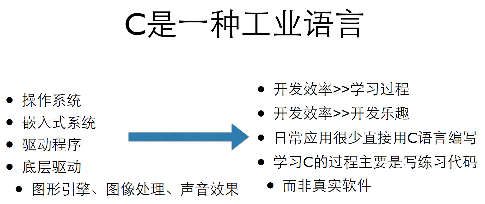

# C语言

C语言是从B语言发展而来的，B语言是从BCPL发展而来的，**BCPL**是从 **FORTRAN** 发展而来的

BCPL和B都支持指针间接方式，所以C也支持了

C语言还受到了PL/1的影响，还和PDP-11的机器语言有很大的关系

## C的发展与版本-标准

1. 1989年ANSI发布了一个标准——ANSI C
2. 1990年ISO接受了ANSI的标准——C89
3. C的标准在1995年和1999年两次更新——C95和C99
4. 所有的当代编译器都支持C99了

## C语言用在哪里

+ 操作系统
+ 嵌⼊入式系统
+ 驱动程序
+ 底层驱动
+ 图形引擎、图像处理、声音效果

## 编译—>运行

+ C 需要被编译才能运⾏行，所以你需要
    - 编辑器
    - 编译器
+ 或者，IDE（集成开发环境）
