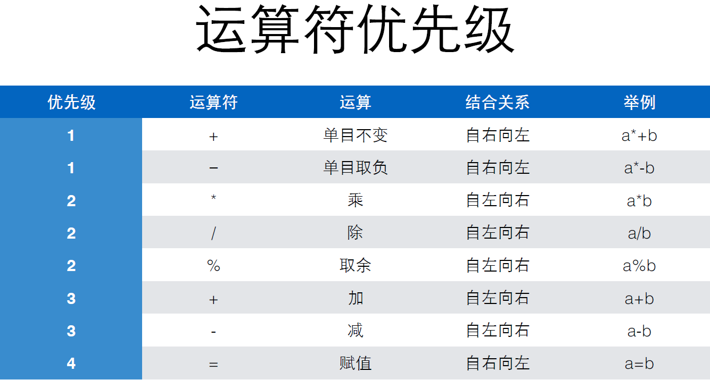

# 表达式计算

## 表达式

一个表达式是一系列运算符和算子的组合，用来计算一个值。

```c
amount = x * (1 + 0.033) * (1 + 0.033) * (1 + 0.033);
total = 57;
count = count + 1;
value = (min / 2) * lastValue;
```

## 运算符

**运算符**是指进行运算的动作，比如加法的“+”和减法的“-”。

**算子**是指参与运算的值，这个值可能是常数，也可能是变量，还可能是一个方法的返回值。

运算有**加减乘除，取余，加括号**这几种。其中取余运算是使用“%”。

## 题目：计算时间差

> 输入两个时间，每个时间分别输入小时和分钟的值，然后输出两个时间之间的差。结果也使用几时几分来表示。

> 思路：全部转化为最小单位进行计算，而后转化为相对应的单位

```c
int hour1, minute1;     // 时间一
int hour2, minute2;     // 时间二
int t1, t2;             // 转化为对应分钟后的变量
int minResult;          // 时间相差的分钟数

scanf("%d %d", &hour1, &minute1);
scanf("%d %d", &hour2, &minute2);

t1 = hour1 * 60 + minute1;
t2 = hour2 * 60 + minute2;

minResult = t1 - t2;

printf("%d H %d m", minResult / 60, minResult % 60);

```

## 题目：计算平均值

> 写一个程序，求解两个整数的平均值 （注意类型的转变）

```c
int a, b;
double result;      // 因为两个整数的平均值可能是一个小数，所以我们选择使用double来存储结果o

sacnf("%d %d", &a, &b);

result = (a+b) / 2.0;   // 2.0会默认是浮点型，结果也会保存为浮点型

printf("%d 和 %d 的平均值是 %f\n", a, b, result);
// %d 是整数的占位符， %f 是浮点数的占位符
```



## n 目运算符

n 目运算符就是根据参与运算的变量的个数来定义的。

单目运算符有：+、-

```c
int a = 10;
int b = -20;
printf("%d", a * - b);
```

双目运算符：+ 、- 、* 、/ 、 % 等

## 赋值运算符

赋值也是运算，也有结果

a = 6 的结果是 a 被赋予的值，也就是 6；

a = b = 6; -> a = (b = 6);

## 计算银行复利

在银行存定期的时候，可以选择到期后自动转存，并将到期后的利息转存入本金继续计算利息。
