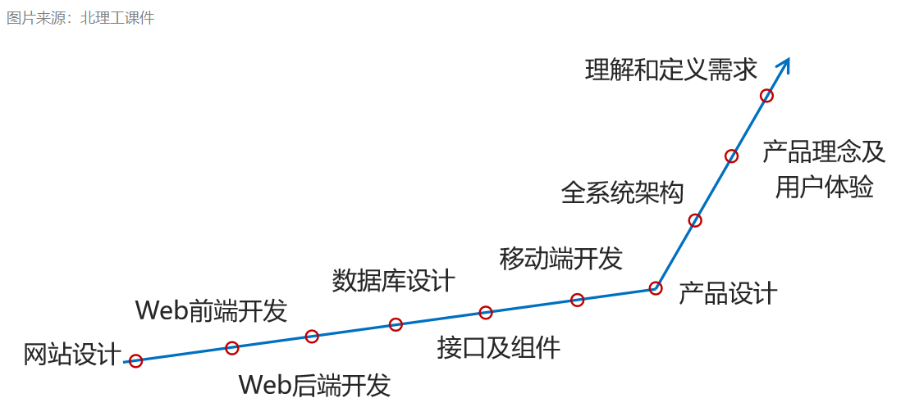
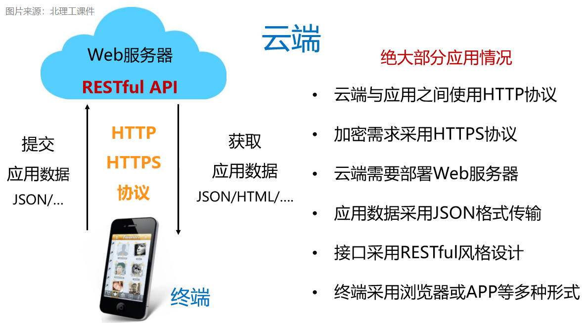
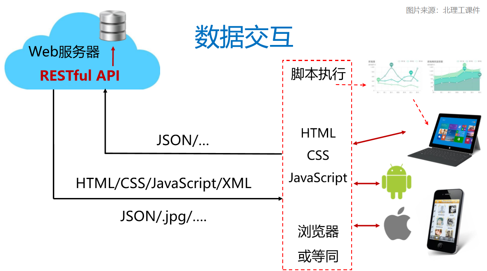
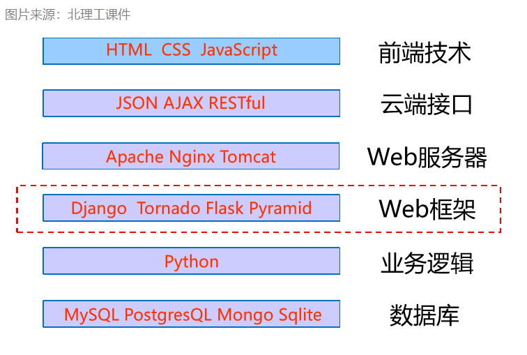
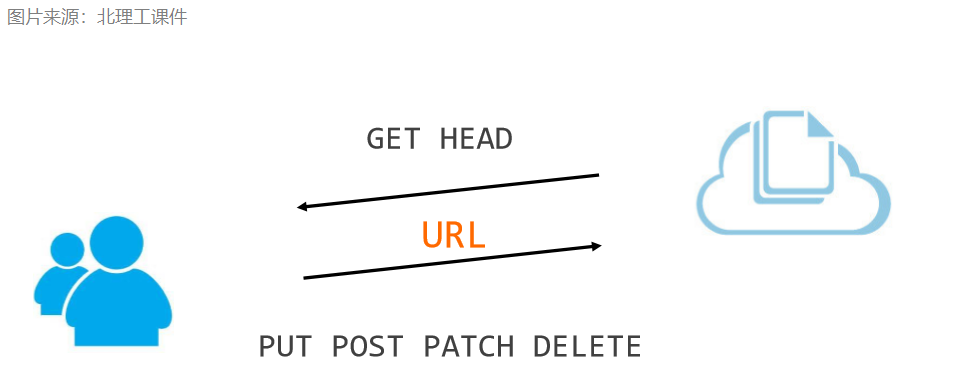

# 云端开发基础

## 1. 云端开发全栈技术简介

这年头：不说个“全栈”都不好意思打招呼

**全栈：概念和技术的有效集合**



## 2. 那什么是云端呢？

简单点说，就是**服务器端**，我们所使用的程序，包含WEB网站、手机APP等，只要不是静态的，则都是通过与云端服务器进行交互才实现的相关功能。用于提供交互体验的我们可以统称为 **应用**（当然，这是指广义上的应用）

+ 云端掌握应用逻辑
+ 云端存储应用数据
+ 云端控制应用权限
+ 云端体现应用智能
+ **应用提供交互体验**

---
Q1: 云端一定有 Web 界面吗？

Q2: 云端一定提供浏览器浏览吗？

A1: 不一定要提供 Web 界面，web界面只提供数据展示的功能，云端可以实现更复杂的业务逻辑和数据的相关处理。

A2: 有了 A1 那我们自然可以想到 Q2 的答案了；云端不一定要提供浏览器浏览，浏览器浏览只是它展示数据的方式之一，我们也可以通过 手机APP 进行数据的交互等。

---

我们用一张图片来展示一下，彼此之间数据是如何交互的




## 3. 我们来看下 Python 的云端体系吧！

一个“全栈”自然是要从*前端 -> Web服务器 -> 业务逻辑 -> 数据存储* 咯，那Python的基础体系是什么样子呢？



前端的一些技术，就不再去一一列举了，有兴趣的小伙伴可以自己去学习哦~

> 哦，对了，推荐一个优雅的前端框架 [Vue.js](https://vuejs.org/)，这里我也有些VUE的学习笔记，可以**[查看](../Vue.js)**哦

## 4. HTTP与Web服务器简介

### HTTP协议

**HTTP**(Hypertext Transfer Protocol)：超文本传输协议；

HTTP是一个基于 **“请求与响应”** 模式的、**无状态** 的应用层协议 HTTP协议采用URL作为定位网络资源的标识，URL格式如下：

```http
http://host[:port][path]

host: 合法的Internet主机域名或IP地址
port: 端口号，缺省端口为80
path: 请求资源的路径
```

HTTP URL的理解： URL是通过HTTP协议存取资源的Internet路径，一个URL对应一个数据资源

### HTTP协议对资源的操作

方法|说明
:-:|:-
GET | 请求获取URL位置的资源
HEAD | 请求获取URL位置资源的响应消息报告，即获得该资源的头部信息
POST | 请求向URL位置的资源后附加新的数据
PUT|请求向URL位置存储一个资源，覆盖原URL位置的资源
PATCH | 请求局部更新URL位置的资源，即改变该处资源的部分内容 DELETE | 请求删除URL位置存储的资源



### Web服务器

Web服务器（Web Server）是软件工具

+ Web服务器用于提供HTTP/HTTPS访问服务
+ Web服务器很成熟，只需要配置，不需要开发
+ 常用的Web服务器软件：
  - Web服务器: Apache、Nginx、IIS、BEA Weblogic、Tomcat、Node.js

