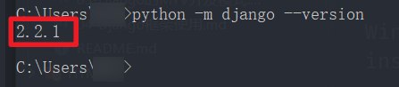

# Django框架基础

## Django简介与安装

首先我们的电脑上要有 `pip`，这个一般正确安装了 python 环境后都具有。

Win平台: “以管理员身份运行”cmd，执行 `pip install django`

## 检测本机Django环境

`python -m django --version`

建议使用Python 3.x和Django 2.x版本进行开发。

## 什么是Django呢？

+ Django是一个Web框架
+ Django是一个产品级框架，支撑全球近万个网站及云端
+ 采用**MTV（Model-Template-View）**模型组织
+ 相比其他框架，Django充分利用Python特点，开发效率更高效
+ [查看官方文档](https://docs.djangoproject.com/en/2.0/)

