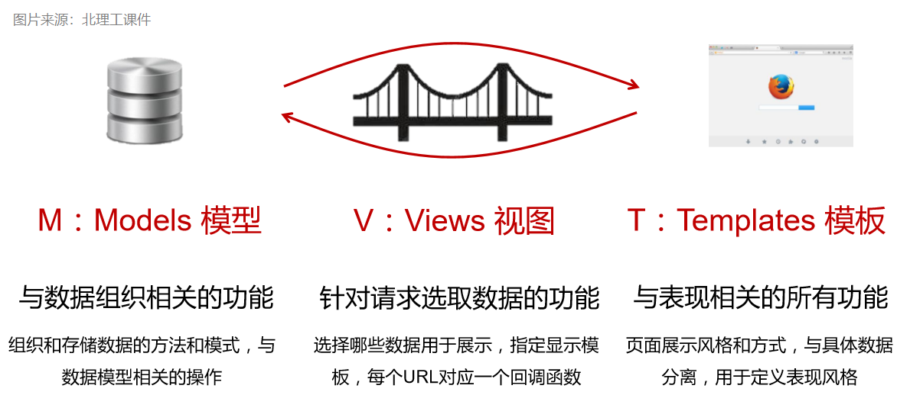
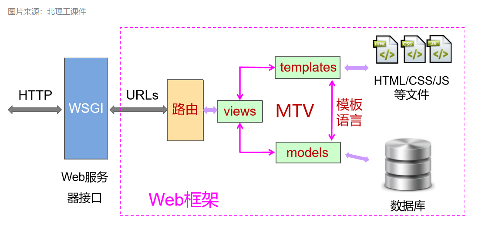
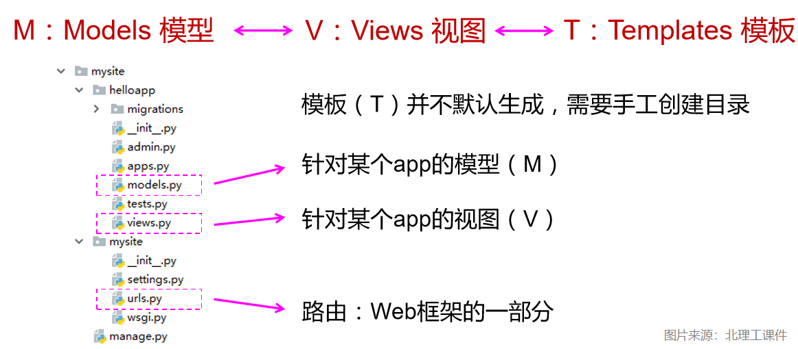

# Django的MTV开发模式

> 目前，我已经接触了三种开发模式：有 MVC，MVVM，还有 MTV

## Web云端系统的三个通用功能需求

数据组织 -- 控制逻辑 -- 页面展示

那么把 MTV开发模式形象一下是什么样子呢？我们看一下北理工嵩天老师的课件：

这里 **M:Models** 相对应的就是 **数据**；中间的 **V:Views** 对应的是 **业务处理**；**T:Templates** 则对应的是**样式和展示**。

详细的框架结构就是下图了：

那我们如果新建一个 Django 项目，项目中的文件和相关层次的对应关系是什么样子的呢？？

