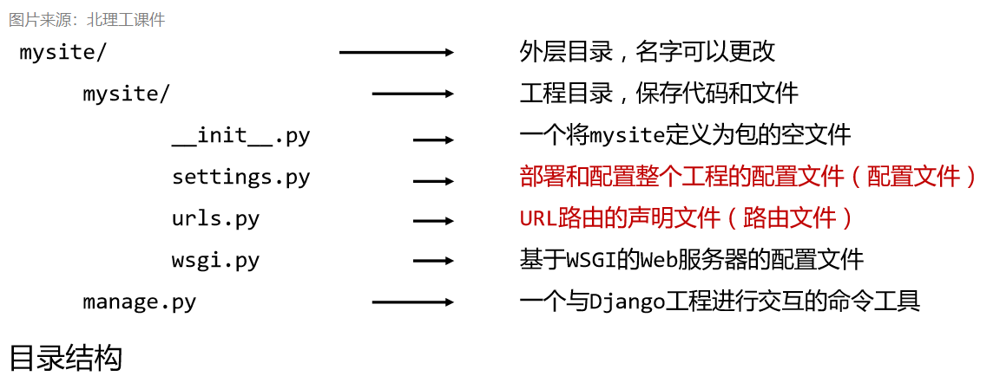
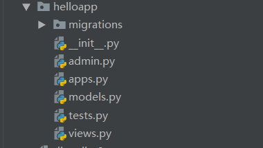
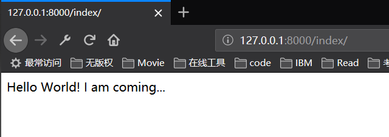

# Django框架使用

> 开发工具： PyCharm社区版 或 专业版 + CMD 命令行

社区版和专业版区别在于，专业版可以直接进行Django项目的创建，而社区版则需要手动进行创建。鉴于我们都是刚入门，我们还是手动创建更好，更利于我们熟悉Django的命令和相关操作。

## 新建 Django 的最小程序

1. ### 新建一个Web框架工程

    我们再命令行界面进到要创建项目的目录下，然后输入以下命令：

    `django-admin startproject mysite`

    这里的 `django-admin` 是一个用于管理 django 的工具，在我们安装 django 的过程中会默认进行依赖安装。 `mysite` 是工程名称，可以根据自己的需求进行修改。创建后，我们会得到以下的目录结构：

    

2. ### 修改工程，增加功能

    我们在这里需要增加具体**应用**，以及通过配置 **路由映射** 来进行相关功能的增加。

    > 工程(project)和应用(app)什么关系呢？
    > + 工程对应于一个网站，是配置和应用的集合
    > + 应用对应于**特定功能**，是具体**功能的载体**
    > + 配置和功能分离是高度模块化的体现

    2.1 【修改工程】创建一个具体应用（app）

    命令：`python manage.py startapp helloapp`

    命令执行完成后，会在根目录下新建一个`helloapp`的目录

    

    2.2 【修改工程】修改应用的`views.py`

    ```python
    # Create your views here.
    from django.http import HttpResponse

    def hello(request):
    return HttpResponse("Hello World! I am coming...")
    ```

    2.3 【修改工程】修改URL路由

    在和项目命对应的目录下的 `urls.py` 文件中指定URL与处理函数之间的路径关系。

    ```python
    from django.contrib import admin
    from django.urls import include, path
    from helloapp import views      # from the subapp import related views

    urlpatterns = [                 # config the routes like vue's vue-router
        path('admin/', admin.site.urls),
        path('index/', views.hello),
    ]
    ```

    我们首先需要引入对应app下的 views 文件，然后配置路由对应关系

    2.3：【修改工程】修改URL路由

    `path('index/', views.hello)`

    这里的 第一个参数 表示url地址，我们这里的就会响应 `域名/index/`这个路径的访问； 第二个参数 则表示指定某个处理函数，例如这里我们制定了 `views.hello`。

    

3. ### 运行工程

    `python manage.py runserver`

    运行后我们访问对应的路由，就会得到相应的返回信息；如果访问未配置的则会返回 404 notfound。

## 不得不说的 `django-admin` 和 `manage.py`

### django-admin

`django-admin <command> [options]`

django-admin是一个Django框架全局的管理工具：

+ 建立并管理Django工程
+ 建立并管理Django工程使用的数据库
+ 控制调试或日志信息
+ 运行并维护Django工程

我们也可以通过 `django-admin help` 命令来查看更多的功能

### manage.py

`python manage.py <command> [options]`

功能和 `django-admin` 类似，但是作用范围仅作用于当前项目。

我们也可以通过 `python manage.py help` 命令来查看更多功能。

## 最小程序的改进

> 需求：返回一个HTML页面，而不是一个字符串 <br>
> 思路：建立模板（T），对应特定请求，返回模板页面<br>
> 新建hello2app，通过index2来访问

1. 新建hello2app应用

    `python manage.py startapp hello2app`

2. 使用`templateTest.html`为返回页面，修改`views.py`

    ```python
    # hello2app/views.py
    from django.shortcuts import render
    def hello(request):
        return render(request, "PYC01-HTMLJSDemo.html")
    ```

    这里，`render()` 是一个打包函数，第一个参数是 request， 第二个参数是要返回的模板页面。

3. 在hello2app应用中，新增`urls.py`文件（本地路由文件）

    ```python
    # hello2app/urls.py

    from django.urls import path
    from . import views         # . 代表当前 app
    urlpatterns = [             # urlpatterns 变量名成是固定的
        path('', views.hello)
    ]
    ```

4. 在全局路由文件中增加对本应用路由文件的引用

    ```python
    # mysite/urls.py

    from django.contrib import admin
    from django.urls import include, path
    # include()函数，用于引入其他路由文件
    from helloapp import views
    urlpatterns = [
        path('index2/', include('hello2app.urls')),
        # 将hello2app的局部路由增加到全局路由中
        path('index/', views.hello),
        path('admin/', admin.site.urls),
    ]
    ```

5. 设置模板路径，让Django框架找到模板所在目录

    我们由于返回了模板文件，所以我们需要对 `mysite/settings.py` 进行修改配置一下路径，

    ```python
    TEMPLATES = [
    {
        'BACKEND': 'django.template.backends.django.DjangoTemplates',
        'DIRS': [os.path.join(BASE_DIR, 'hello2app/templates')],    # 指定templates所在路径
        'APP_DIRS': True,
        'OPTIONS': {
            'context_processors': [
                'django.template.context_processors.debug',
                'django.template.context_processors.request',
                'django.contrib.auth.context_processors.auth',
                'django.contrib.messages.context_processors.messages',
                ],
            },
        },
    ]
    ```

