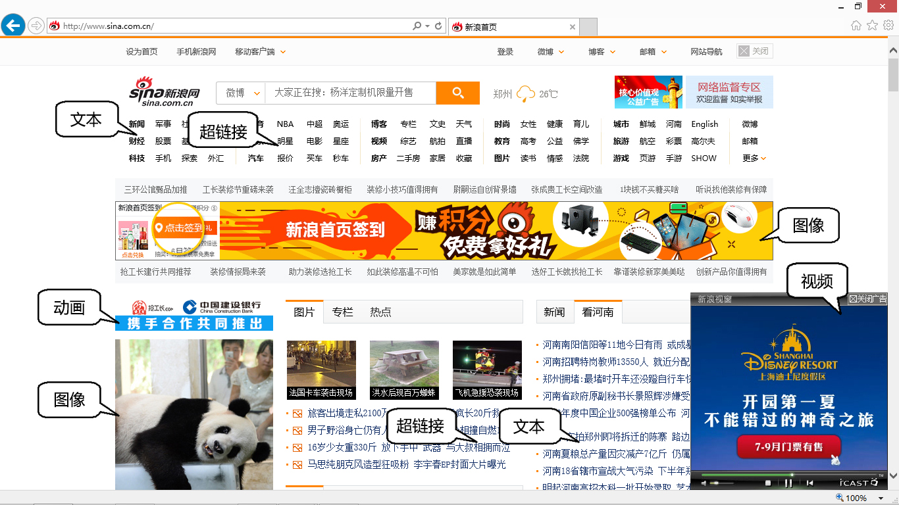
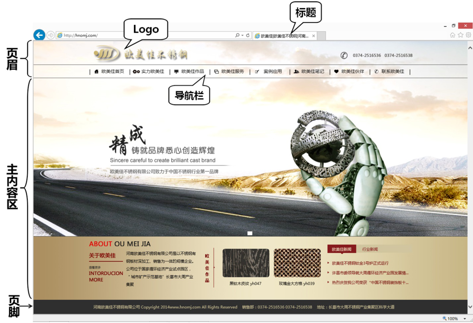

# 网页设计基础知识

## 网页相关知识简介

### 互联网、因特网、万维网的关系和区别

**互联网**指由若干计算机网络相互连接而成的网络。互联网的英文用开头字母小写的“internet”，不是专有名字，**泛指**由多个计算机网络相互连接而成一个大型网络。因特网和其它类似的由计算机相互连接而成的大型网络系统，都可算是“互联网”，因特网只是互联网中最大的一个。

**因特网**是目前全球最大的一个电子计算机互联网，是由美国的ARPA网发展演变而来的。但因特网**并不是全球唯一**的互联网络。因特网的英文为“Internet”，专指全球最大的也就是我们通常所使用的互联网络——因特网，“因特网”是作为专有名词出现的，因而开头字母必须大写。

**万维网**是指环球信息网，英文全称为“World Wide Web”，简称“`WWW`”。万维网是`基于TCP/IP协议`实现的，是指在因特网上以超文本为基础形成的信息网，它为用户提供了一个可以轻松驾驭的图形化界面，用户通过它可以查阅Internet上的信息资源。TCP/IP协议由很多协议组成，不同类型的协议又被放在不同的层，其中位于应用层的协议就有很多，比如 `FTP` 、`SMTP` 和 `HTTP`。只要应用层使用的是HTTP协议，就称为万维网。简而言之，万维网是通过互联网获取信息的一种应用，我们所浏览的网站就是WWW的具体表现形式，但其本身并不就是互联网，只是互联网的组成部分之一。

### 网站和网页

简单来说网站是 **多个网页** 的集合。

网页就是以html语言为基础编写的，能够通过网络传输，并被浏览器翻译成可以显示出来的包含文字、图片、声音、动画等媒体形式的页面文件。

通俗点说，就是我们最常看到的页面！但是多个页面合到一起组成的站点，就叫网站。

### 网页与HTML

网页呈现在用户面前的是各种文字、图像、动画、音频、视频等丰富的内容，而网页在本质上是文本文件和其相关的资源，网页最根本的语言是 HTML（*HyperText Markup Language*，中文译为超文本标记语言）。HTML是Web编程的基础，是网页设计和开发领域的一个重要组成部分，HTML指定如何在浏览器中显示网页，它是制作网页的一种标准语言。

### 静态网页和动态网页

静态网页和动态网页的区别**不体现在视觉效果上**，而**体现在两者所采用的技术**。

静态网页是指没有后台数据库、不含程序的网页。你编写的是什么它显示的就是什么、不会有任何改变。静态网页相对更新起来比较麻烦，适用于更新较少的展示型网站。静态网页有一个固定的url，且以htm、html、shtml、xml等形式为后缀，发布在服务器上的静态网页是事先保存在服务器上的文件，每个网页都是一个独立的文件；内容相对稳定，容易被搜索引擎检索。

动态网页一般使用 `ASP、PHP、JSP、.net` 等网络编程语言编写，是运行于服务器端的代码，浏览时先将服务器端代码执行成html代码，然后再显示在客户端浏览（访客是无法看到这个文件的源代码的，看到的只是比如asp代码通过服务器执行过后的html代码）。

动态网页可以实现的功能较多，如用户注册、登录、在线调查、用户管理、订单管理、站内搜索、即时更新新闻、留言或书写评论等，一般以asp、jsp、php等常见形式为后缀，而且动态网页的网址中通常有一个标志性的“?”。

### IP地址、域名和URL

IP地址是指互联网协议地址（*Internet Protocol Address*）。IP地址是IP协议提供的一种统一的地址格式，它为互联网上的每一个网络和每一台主机分配一个逻辑地址，以此来屏蔽物理地址的差异。

IP地址是一组数字，不方便记忆，因此人们为每台计算机赋予了一个具有代表性的名字，这就是主机名，主机名由英文字母或数字组成，将主机名和IP对应起来，这就是**域名**。

---
URL是*Uniform Resource Locators*的缩写，中文翻译为“**统一资源定位符**”，它是对资源位置的一种表示，是互联网上标准资源的地址。互联网上的**每个文件都有一个唯一的URL**，它包含的信息指出文件的位置以及浏览器应该怎么处理它，通常称为URL地址，这种地址可以是各种形式的文件，也可以是局域网上的某一台计算机，更多的是Internet上的网址。

### HTTP和FTP

这属于计算机网络中的一部分内容，这里只做下大致的介绍。

HTTP是*HyperText Transfer Protocol*的缩写，中文译为“超文本传输协议” 。HTTP是客户端浏览器或其它程序与Web服务器之间的应用层通信协议。在Internet上的Web服务器上存放的都是超文本信息，客户机需要通过HTTP协议传输所要访问的超文本信息。

FTP是*File Transfer Protocol*的缩写，中文译为“文件传输协议”，用于Internet上的控制文件的双向传输。

**HTTP协议用于链接到某一网页，而FTP协议则用于上传或下载文件。**

## 网页的基本元素

网页作为信息的载体，包含各种各样的元素，从网页的内容或者多媒体元素的角度出发，网页包含文本、图像、动画、音频和视频等，从布局设计的角度看，网页包含页眉、主内容区和页脚等

从网页上包含的内容来看，网页的基本元素包括文本、图像、动画、音频、视频等多种媒体元素，除此以外，我们也把目光关注到网页中使用非常频繁的元素超级链接上，下图是新浪网首页的基本媒体元素。

---

1. 文本

    一般情况下，网页中的信息以文本为主。建议用于网页正文的文字一般不要太大，也不要使用过多的字体，中文文字一般可使用宋体。

2. 图像

    图像是美化网页必不可少的元素，适用于网页的图像格式主要有JPEG、GIF和PNG。

3. 动画

    动画是网页中最活跃的元素，创意出众、制作精致的动画是吸引浏览者眼球的最有效方法之一。但物极必反，过多的动画容易使人眼花缭乱，进而产生视觉疲劳。网页中使用较多的动画是GIF动画（也可以理解为GIF图像）与Flash动画。

4. 音频

    音频的适当使用能极好地吸引读者，烘托良好的艺术氛围。但添加音乐后，网页加载速度会受到影响，另外不同的浏览器对于音频文件的处理方法是不同的，彼此之间很可能不兼容。

5. 视频

    视频文件可以给访问者带来强烈的视觉冲击力，让网页内容更加丰富。随着网络带宽的增加，网页中应用的视频文件格式也越来越多，常见的有RM、WMV、ASF、MPEG、AVI、RMVB和DivX等。

6. 超级链接

    超级链接简称超链接，是Web网页的主要特色，指从一个位置指向另一个目的端的连接关系。

### 网页的基本布局元素

从布局设计的角度讲，网页一般由标题、页眉、主内容区和页脚部分构成，页眉部分通常包括网站logo和导航栏，如下图所示。

1. 网页标题

   网页标题是对一个网页内容的高度概括，便于搜索引擎搜索，预览时通常出现在浏览器的标题栏中以及状态栏中。

2. 页眉

   页眉是指页面上端的部分，大多数网站制作者在页眉部分设置站点名字图片或标志、网站宗旨、展示宣传网站的广告条和动画、链接网页的导航栏，以及跳转网页的按钮等，有的则把它设计成广告位出租。当然，页眉也并非所有网页都有，一些特殊的网页就没有明确划分出页眉。

   + Logo

        Logo是徽标或者商标的英文缩写，起到对徽标拥有公司的识别和推广的作用，网络中的徽标主要是各个网站用来与其它网站链接的图形标志，代表一个网站或网站的一个板块。下图是几个网站的Logo示例。

        
        

3. 主内容区

    顾名思义，主内容区放置网页的主体元素，往往有文字、图像、下一级内容的超链接构成，有一些网页还加入音频、视频等多媒体元素。

4. 页脚

   页脚位于网页的最底部，和页眉相呼应。页脚部分通常用来介绍网站所有者的具体信息，如名称、地址、联系方式、ICP备案、网站版权、制作者信息等，其中一些内容也可能被做成标题式超链接，引导用户进一步了解详细内容。

## 网页设计常用技术

WEB标准中，网页主要由三部分组成：**结构（Structure）**、**表现（Presentation）** 和 **行为（Behavior）**。对应的标准也分三方面：结构化标准语言主要包括HTML、XHTML和XML，表现标准语言主要包括CSS，行为标准主要包括ECMAScript（网页脚本语言规范）等。

### 网页标记语言HTML

HTML是为创建网页和设计其它可在网页浏览器中看到的信息的一种**标记语言**；它以纯文字格式为基础，可以使用任何文字编辑器或所见即所得的HTML编辑器来编辑HTML文件。HTML被用来结构化信息——例如标题、段落、列表和图像等等，主要负责网页的“内容”部分。

无论使用任何工具制作网页，网页的本质是由HTML构成的，掌握好HTML是精通网页制作的最根本要求。

### 网页表现技术CSS

CSS是*Cascading Style Sheet*的缩写，中文译为“**层叠样式表**”，简称“样式表”。用来*定义网页外观样式*、特别是进行网页的*排版布局*。HTML和CSS分别实现了网页内容和样式的设计，实现了结构和外观的分离，使站点的访问及维护更加容易。

如今网页排版愈发复杂，布局样式都需要通过CSS来实现，学好CSS技术是精通网页制作的基本要求。

### 网页脚本语言JavaScript

脚本语言由 **ASCII码** 构成，是一种**不必事先编译**，只要利用**适当的解释器**就可以执行的简单程序。在网页中使用脚本语言，可以丰富网页的表现力，是网页设计中很重要的一种技术。目前常用的脚本有JavaScript、VBScript和Jscript，其中JavaScript是众多网页开发者首选的脚本语言。

### 动态网页编程技术

网页的发展绝不满足于仅供用户单纯地浏览，更应该着重于用户的交互操作和对网站内容的便捷管理，这些都需要动态网页编程技术来实现，目前常用的动态网页编程技术有JSP、ASP.NET和PHP等。

JSP是基于Java的动态网页技术标准，用于创建可支持跨平台及Web服务器的动态网页。

ASP是微软公司推出的Web服务器端脚本开发环境，ASP.NET是ASP技术的升级换代版。

PHP 是一种 HTML 内嵌式语言，也是一种在服务器端执行的嵌入HTML文档的脚本语言，语言比较简单，属于轻量级的高级语言。

## 网页设计常用工具

HTML文件的编写可以使用**任何文本编辑器**，如**记事本**（前期建议使用 记事本 进行编写提高对代码的记忆）、写字板、word等，不过在保存时都必须保存为.html或者.htm格式。为了使设计网页更加简单、方便，有些公司和人员设计了专业的HTML编辑工具，这些工具绝大多数可以分为两类，一类是基于文本的HTML编辑器，第二类是所见即所得编辑器。

### 文本编写工具

1. Windows自带的记事本（前期推荐）

    最简单的基于文本的编辑器，严格意义上并不能被称为HTML编辑器，但它简单易得，可以编辑HTML、CSS、JavaScript等，在学习HTML之初是一个非常好的选择，缺点是记事本只是基本的文字编辑软件，没有代码提示、检查等功能。
2. Notepad++

    Notepad++是一套自由软件的纯文本编辑器，它的功能比Windows中的记事本（Notepad）强大，除了可以用来制作一般的纯文字的帮助文档，也十分适合用作撰写电脑程序的编辑器。
3. Phase 5

    Phase 5是自从1998年就被人期待和熟知的网页编辑器，它支持大多语言的格式，例如HTML、PHP、JavaScript和VBScript等。

4. VS Code

    微软开源力作，宇宙最强编辑器，最轻IDE。

    Visual Studio Code（以下简称vscode）是一个轻量且强大的跨平台开源代码编辑器（IDE），支持Windows，OS X和Linux。内置JavaScript、TypeScript和Node.js支持，而且拥有丰富的插件生态系统，可通过安装插件来支持C++、C#、Python、PHP等其他语言。

### 所见即所得编辑器

Dreamweaver ，可以自行百度搜索，笔者不建议使用这类的编辑器。一方面是出于对代码的尊重，另一方面是因为很多时候所见即所得编辑器并不如我们想象中的那般易于使用，会产生多余代码并且具有很强的局限性。

有兴趣的可以下载尝试一下。

### 如何选择工具

初学者可能会毫无疑问的爱上所见即所得编辑器，但一些开发者更喜欢使用基于文本的编辑器来完成工作，原因是所见即所得编辑器占用更大的系统资源，并且容易产生冗余代码，使得一些不必要的代码重复出现多次，更糟糕的它无可避免的会出现“所见非所得”的现象。

笔者在这里建议，刚入门的时候可以先使用不提供代码提示的记事本进行代码的编写与网页的调试，到后期，代码掌握的熟练了，尝试使用含有代码提示的IDE进行开发。

IDE 的话个人比较钟意 VSCode， 后期你们使用也会感觉要起飞了~
