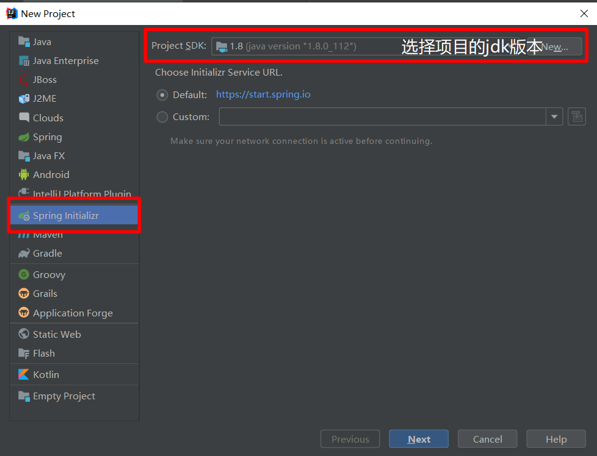
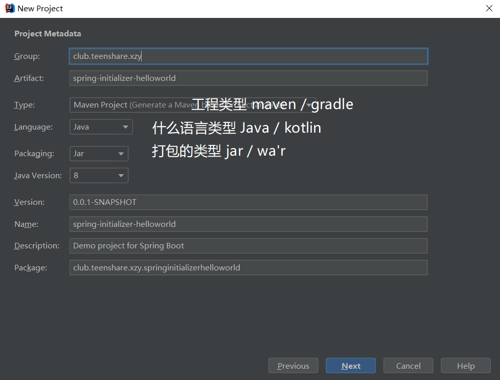
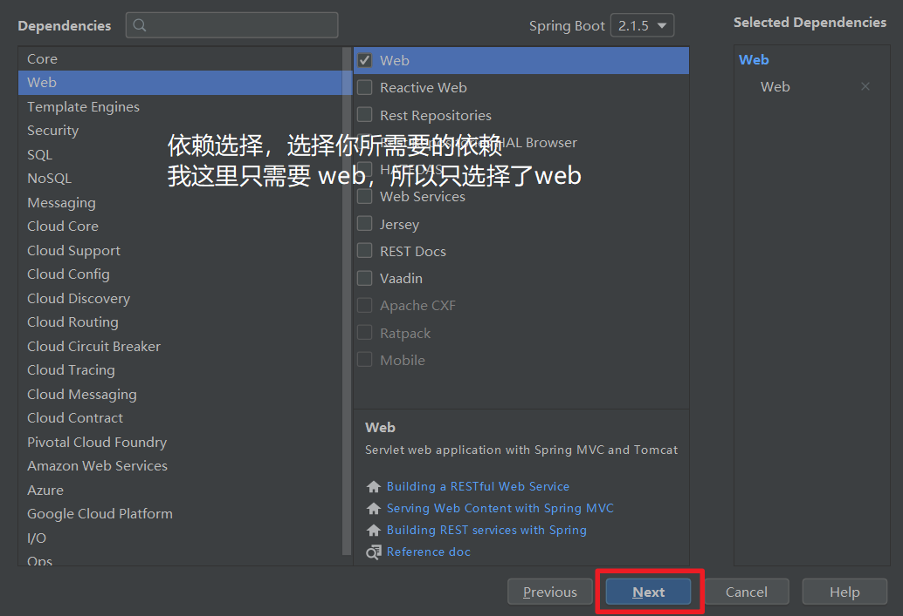

# Spring Boot使用Spring Initializer快速创建项目

## 使用IDEA生成项目

目前的 IDE 都支持通过使用向导（Spring Initializer）快速创建Spring项目

我这里以IDEA为例：

1. 选择JDK版本


2. 填入工程坐标，即组ID等属性，同时确定工程类型和编程语言类型


3. 选择工程依赖即所需模块，NEXT 创建


4. Spring Initializer 会**联网**生成相关项目到指定位置

## 生成后我们需要做什么？

生成的项目目录中包含了一些非必要的文件或者文件夹，例如：`.gitignore`，`HELP.md`文件等，这些适用于项目要提交到 GITHUB 或者 GITEE 上的项目，如不需要，可删去。

默认生成的Spring Boot项目：

+ 主程序已经写好了，我们只需要写自己的业务逻辑，例如：controller的创建和映射

```java
/*
// 这个类所有的方法返回的数据直接写给浏览器，避免了为每个方法重复写注解; 如果是对象，会转化为 JSON 数据写出去
@ResponseBody
@Controller
*/
// RestController 是下边两个的合体，所以可以直接写一个来顶替这两个
@RestController
public class HelloController {

    @RequestMapping("/hello")   // 用于相应 /hello 请求
    public String Hello(){
        return "Hello World Spring Initializer";
    }
    // RESTAPI 的方式
}
```

+ resources 文件夹中的目录结构
    - `static`: 保存所有静态资源；js css images 等
    - `templates`: 保存所有的模板页面；（**Spring Boot默认jar包使用嵌入式的Tomcat，默认不支持JSP页面**）可以使用模板引擎（freemarker， thymeleaf等）
    - `application.properties`: Spring Boot应用的配置文件；我们可以在这里来修改一些默认配置；例如，修改默认的端口号：`server.port = 3000` 等一些配置

