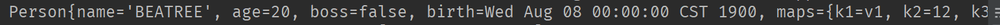
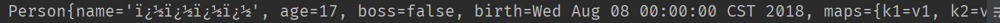
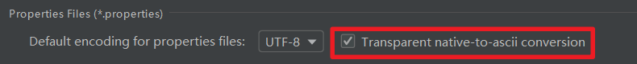

# YAML 语法

## 1. 基本语法

`k: v`：表示一对键值对（注意，在value前有一个空格，这个空格是**必需**的）

若配置项之间有层级关系，则仍是**通过空格**来控制层级关系，左对齐的是同一层级的属性。 属性和值也是**大小写敏感的**

例子：

```yaml
server:
  port: 8088
  path: /hello
```

## 2. YAML支持的三种数据结构

### 字面量： 普通的值（数字，字符串，布尔 ...)

`k: v`: 字面量直接来写；

+ 字符串默认不需加上单引号或双引号
+ 双引号 ""：不会转义字符串中的特殊字符，即特殊字符会作为本身的意思；`name: hello \n world` 输出：`hello 换行 world`； 的形式
+ 单引号 ''：特殊字符会转为普通的字符串；`name: hello \n world` 输出：`hello \n world`； 的形式

### 对象、map（属性和值）：键值对类型

k: v: 再下一行来写属性和值的关系，同样，注意缩进。

```yaml
friends:
    name: BEATREE
    age: 20
    sex: handsome boy
```

行内写法：

```yaml
friends: { name: BEATREE, age: 20, sex: handsome boy }
```

### 数组(List, Set)

1. 用 `- ` (短横线+空格)表示数组中的一个元素

例子：

```yaml
girlfriends:
 - Lily
 - Keven
 - Coingzn
```

行内写法：

```yaml
girlfriends: [Lily,Keven,Coingzn]
```

## 3. YAML配置文件值注入

为了测试，我们首先在项目中新建一个 Person 类，然后我们在其内填上各种属性，包括基础类型、非基础类型以及对象等。

Person.java :

```java
/*
* 将配置文件中配置的每一个属性的值，映射到这个组件中
* @ConfigurationProperties: 告诉Spring Boot将本类中所有的属性和配置文件中相关的配置进行绑定；
* (prefix = "person") : 配置文件中同哪个下边的属性进行一一映射
*
* 又：只有这个组件是容器中的组件，才能使用容器提供的功能。例如 @ConfigurationProperties,
* 所以我们需要加上 @Component 注解
*/
@Component
@ConfigurationProperties(prefix = "person")
public class Person {
    private String name;    // person's name
    private Integer age;    // person's age
    private Boolean boss;   // is this person a boss
    private Date birth;

    private Map<String, Object> maps;
    private List<Object> lists;
    private Boy handsomeBoy;

    setters
    ...

    getters
    ...
}  
```

Boy.java :

```java
public class Boy {

    private String name;
    private Integer age;

    setters
    ...

    getters
    ...
}
```

```yaml
person:
  name: BEATREE
  age: 20
  boss: false
  birth: 1900/08/08
  maps: {k1: v1, k2: 12, k3: 13}
  lists:
    - 李四
    - 王五
  handsomeBoy:
    name: ViGO
    age: 18
```

在 Person.java 文件添加注解`@ConfigurationProperties(prefix = "person")`后，IDE中会弹出一个提示框


我们需要在 .pom 文件中进行添加

```xml
<!-- 导入配置文件处理器，配置文件进行绑定就会有提示 -->
<dependency>
    <groupId>org.springframework.boot</groupId>
    <artifactId>spring-boot-configuration-processor</artifactId>
    <optional>true</optional>
</dependency>
```

然后重新运行一下项目：


然后我们执行一次单元测试，输出我们的Person

```java
@RunWith(SpringRunner.class)
@SpringBootTest
public class SpringInitializerHelloworldApplicationTests {

    @Autowired  // 自动装载一下PERSON
    Person person;

    @Test
    public void contextLoads() {
        System.out.println(person);
    }

}
```

可以看到控制台拿到了相关的数据


同样的，我们用.properties进行一下配置

```properties
# idea用的是utf-8编码
# 配置person的值
person.name=张三
person.age=17
person.boss=false
person.birth=2018/08/08
person.maps.k1=v1
person.maps.k2=v2
person.lists=a,b,c
person.handsome-boy.name=BEATREE
person.handsome-boy.age=15
```

我们发现控制台输出的存在乱码：


这是因为在IDEA中的`File Encoding`的设置问题，我们需要勾上设置中的这个框



> 通过两个配置文件的对比，我还是更吸引 `.yml` 这种格式的配置。

### 1. @Value获取值和@ConfigurationProperties获取值比较

|注入方式|@ConfigurationProperties|@Value
|---|---|---|
|功能|批量注入配置文件中的属性|一个个指定注入
|松散绑定（松散语法）|⭕支持|❌不支持
|SpEL|❌不支持|⭕支持
|JSR303数据校验|⭕支持|❌不支持
|复杂类型封装|⭕支持|❌不支持

1. 松散绑定（松散语法）：就是配置文件中的属性书写方式。

@Value 不支持 松散绑定 配置文件名必须和类属性名相同。否则则会报错

```xml
person.fullName    与类中同名
person.full-name   使用 - 替换大写
person.full_name  使用  _  替换大写
```

2. SpEL：EL 表达式

```java
@Value("#{11*2}")   // 这里会进行计算，age会被注入 22， 在配置文件中则不可以
private Integer age;
```

3. JSR303数据校验

```java
@Component
@Validated  // JSR303 数据校验
@ConfigurationProperties(prefix = "person")
public class Person {
    @NotNull    //不能为空
    @Email      //需要是Email的格式
    private String name;    // person's name
    private Integer age;    // person's age
    private Boolean boss;   // is this person a boss
    private Date birth;
    ...
}
```

yml文件配置内容如下：

```yml
person:
  name: 做棵大树
  age: 20
  boss: false
  birth: 1900/08/08
  maps: {k1: v1, k2: 12, k3: 13}
  lists:
    - 李四
    - 王五
  handsomeBoy:
    name: ViGO
    age: 18
```

由于name不符合校验内容，这时候启动项目会报错。

```cmd
Description:

Binding to target org.springframework.boot.context.properties.bind.BindException: Failed to bind properties under 'person' to club.teenshare.xzy.springinitializerhelloworld.bean.Person failed:

    Property: person.name
    Value: 做棵大树
    Origin: class path resource [application.yml]:5:9
    Reason: 不是一个合法的电子邮件地址
```

4. @Value 不支持复杂类型的封装，例如`Map` `List` 等；但是`properties`支持。

#### 如何选择 `@Value` 还是 `properties` ？

> 如果我们只是在某个业务逻辑中需要获取一下配置文件中的某项值，我们就使用 `@Value`。

例子：

```java
@RestController
public class HelloController {

    @Value("${person.name}")
    private String name;
    @RequestMapping("/hello")   // 用于相应 /hello 请求
    public String Hello(){
        return "Hello "+ name;
    }
}
```

这样就可以拿到配置文件中对应的值: *做棵大树*

> 如果我们专门编写了一个 JavaBean 类和配置文件映射，我们就使用 @ConfigurationProperties

### 2. @PropertySource 和 @ImportResource

`@PropertySource`: 加载指定的配置文件，这里以`.properties`进行操作；

解析`.yml`配置文件请：[点击查看加载.yml配置文件](https://www.jianshu.com/p/37b228028d72)

```java
/*
* 将配置文件中配置的每一个属性的值，映射到这个组件中
* @ConfigurationProperties: 告诉Spring Boot将本类中所有的属性和配置文件中相关的配置进行绑定；
* (prefix = "person") : 配置文件中同哪个下边的属性进行一一映射
*
* 又：只有这个组件是容器中的组件，才能使用容器提供的功能，所以需要添加@Component。例如 @ConfigurationProperties

* @ConfigurationProperties(prefix = "person") 默认从全局配置文件文件中获取，配置过多会导致配置文件过大
* @PropertySource( value = {"classpath:person.properties"})  //加载指定配置文件
*/
@PropertySource( value = {"classpath:person.properties"})  //加载指定配置文件
@Component
//@Validated  // JSR303 数据校验
@ConfigurationProperties(prefix = "person")
public class Person {
//    @NotNull    //不能为空
//    @Email      //需要是Email的格式
    private String name;    // person's name
    private Integer age;    // person's age
    private Boolean boss;   // is this person a boss
    private Date birth;

    private Map<String, Object> maps;
    private List<Object> lists;
    private Boy handsomeBoy;


    @Override
    public String toString() {
        return "Person{" +
                "name='" + name + '\'' +
                ", age=" + age +
                ", boss=" + boss +
                ", birth=" + birth +
                ", maps=" + maps +
                ", lists=" + lists +
                ", handsomeBoy=" + handsomeBoy +
                '}';
    }
    setters
    ...

    getters
    ...
}
```

person.properties (注释掉了默认配置文件的相关内容，放到了person.properties):

```properties
person.name=做棵大树
person.age=17
person.boss=false
person.birth=2018/08/08
person.maps.k1=v1
person.maps.k2=v2
person.lists=a,b,c
person.handsome-boy.name=BEATREE
person.handsome-boy.age=15
```

`@ImportResource`: 导入Spring的配置文件，让配置文件中的内容生效。