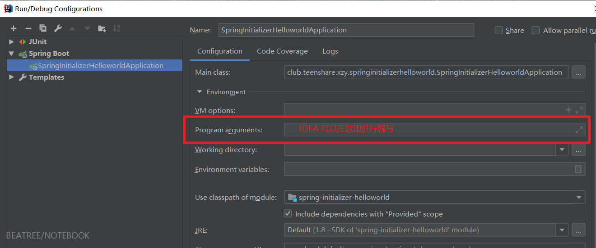
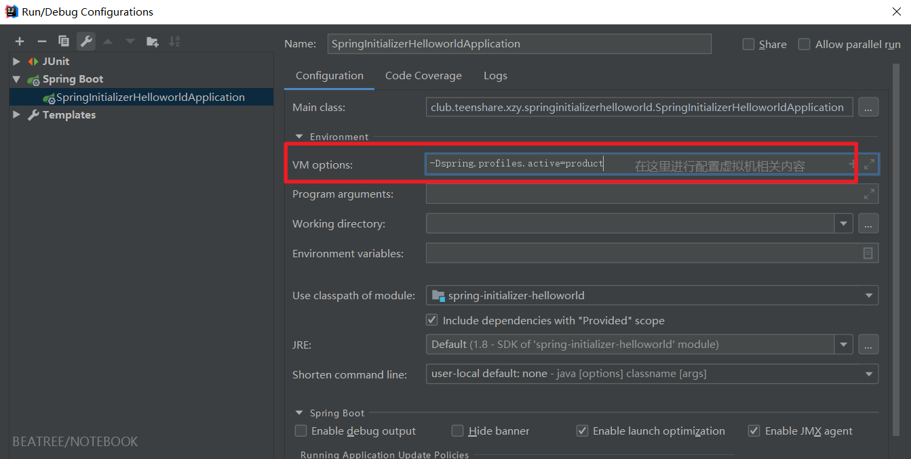

# Profile

## 1、多 Profile 文件

我们在主配置文件编写的时候，文件名可以是 `application-{profile}.properties(yml)`；例如开发环境的配置文件我们可以命名为 `application-dev.properties`；生产环境我们使用 `application-product.properties`；

默认启动服务器会使用 `application.properties` 的配置文件，我们如果想要使用默认的配置文件，则可以通过在 `application.properties` 中指定 profile 进行配置文件的指定：

```properties
spring.profiles.active=dev
```

```properties
spring.profiles.active=product
```

控制台两次输出内容：

```cmd
2019-06-01 22:51:57.289  INFO 876 --- [           main] o.s.b.w.embedded.tomcat.TomcatWebServer  : Tomcat initialized with port(s): 8082 (http)
```

```cmd
2019-06-01 22:56:38.128  INFO 404 --- [           main] o.s.b.w.embedded.tomcat.TomcatWebServer  : Tomcat initialized with port(s): 8083 (http)
```

我们看到它启动了 8082 号端口，这个端口则是在 `application-dev.properties` 中指定的，8083 端口则是在 `application-product.properties` 中指定的。

## 2、yml 支持多文档块注释

在 yml 文件中，可以通过 `---` 来划分文档块，每个文档块中可以编写不同的配置文件，如果我们需要加载某个配置文件，则可以通过在 文档块一 中进行指定 `active` 哪个文档块。

```yml
server:
  port: 8088
spring:
  profiles:
    active: dev
---
server:
  port: 8081

spring:
  profiles: dev
---
server:
  port: 8082

spring:
  profiles: product
```

## 3、 激活指定profile文件

1. 在配置文件中指定 `spring.profiles.active=ProfileName` 进行指定，或者

    ```yml
    spring:
      profiles:
        active: dev
    ```

2. 命令行： `--spring.profiles.active=ProfileName` 的方式来指定；

    **可在IDE下进行设置;**

    

    **也可以将项目打包后**，使用 `java -jar *** --spring.profiles.active=ProfileName` 来指定启动的环境

3. 虚拟机参数 `-Dspring.profiles.active=ProfileName`

    注意上边的命令中的 **`-D`** 这是固定写法，虚拟器启动需要放在前边。

    
