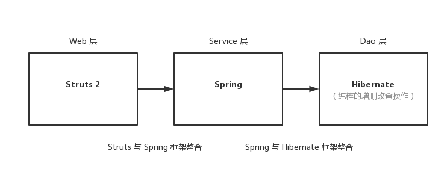
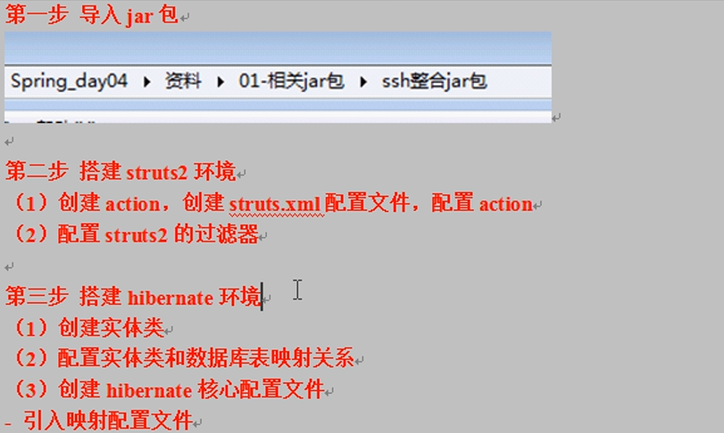
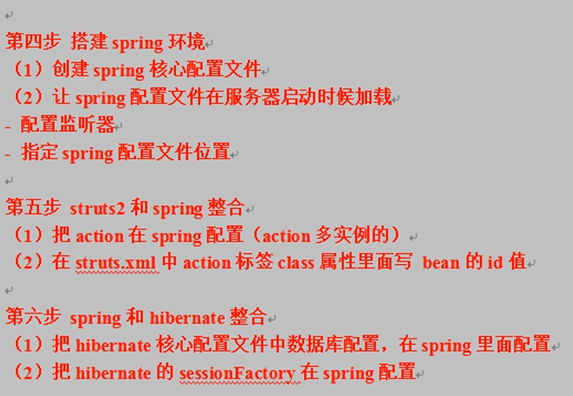
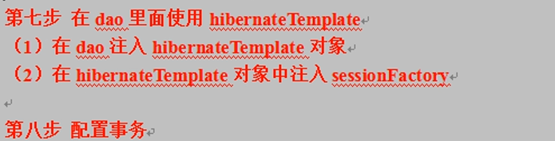

# SSH 框架总结与整合

## SSH 框架核心

### Struts

1. Action 操作
    + Action 创建 (三种方式)：继承 `ActionSupport` 类。
    + Action 访问路径：创建 `struts.xml` 配置文件，文件名称和位置 ( Src 目录 ) 固定。
    + 访问 Action 的多个方法：使用 通配符方式 配置。
    + Action 获取表单提交数据：
       + 获取 `Request` 对象 ( 使用 `ServletAction` 类 )；
       + 属性封装；
       + 模型驱动；
    + Action 操作域对象：使用 `ServletAction` 类。
    + 配置 Struts2 过滤器。
2. 值栈
    + 向值栈放数据：
       + `Set` 方法；
       + `Push` 方法；
       + 定义变量，生成 `Get` 方法.
    + 从值栈获取数据：在 JSP 中使用 **Struts2 标签 + Ognl** 获取
        + `<s:property />`
        + `<s:iterator />`
3. 拦截器
    + `AOP` 和**责任链模式**；
    + 自定义拦截器：
      + 继承 MethodFilterInterceptor 类，并重写类方法；
      + 配置拦截器和 Action 关联.

### Spring

1. Spring 核心配置文件：
   + 名称和位置没有固定要求；
   + 在 Spring 核心配置文件中引入 Schema 约束.
2. 创建对象：
   + XML 配置方式：`<bean id="" class="" />`；
   + 注解方式：`@Component` 或 `@Controller` (Web层)、`@Service` (业务层)、`@Repository` (持久层).
3. 注入属性:
   + XML 配置方式：`<bean id="" class=""><property name="" ref="" /></bean>`；
   + 注解方式：`@autowired`、`@Resource(name="value")`.
4. 使用 `ServletContext` 对象和监听器实现
   + 在服务器启动时，加载 Spring 配置文件，创建对象；
   + 配置 Spring 的监听器；
   + 指定 Spring 配置文件位置.
5. Spring JdbcTemplate
6. Spring 事务配置：
   + XML 配置方式；
   + 注解方式：`@Transational`

### Hibernate

1. ORM 思想：对象关系映射
2. 数据库信息配置：MySQL / SQL Server 2008 R2；

3. Hibernate 信息配置：即配置 Hibernate 核心配置文件 ( `hibernate.cfg.xml` )。

4. **Hibernate 和 Spring 整合时，配置文件的名称和位置是没有固定要求的**。

5. 映射关系配置：即配置 Hibernate 映射配置文件 ( `xxx.hbm.xml` )，实体类和数据表映射关系 ( 使用 `ORM` 思想 )。
6. Hibernate 操作步骤：*Spring 框架对 Hibernate 框架也有封装*，即 `HibernateTemplate` 类。

## SSH 整合



整合的整体流程：






### Spring 与 Struts 2 框架的整合

把 Struts 2 的 **Action 对象创建交给 Spring 进行管理**。

```java
<bean id="" class="" scope="prototype" />
```

### Spring 与 Hibernate 框架的整合

把 Hibernate 的核心配置文件里的**数据库配置**，直接**写在 Spring 配置文件中**。且把 `SessionFactory` **对象创建交给 Spring** 管理。

Spring 会在服务器启动的时候就创建 `SessionFactory` 对象。

## SSH 整合演示

### Struts2 && Spring

1. 导入相关文件的 jar 包
2. action的创建
3. 创建核心配置文件，配置 `struts.xml` 和`applicationContext.xml`

最终完成后的代码文件：

`UserAction.java`

```java
public class UserAction extends ActionSupport {
	@Override
	public String execute() throws Exception {
		System.out.println("I'm in UserAction !!!!!");
		return NONE;
	}
}
```

`Struts.xml`配置我们的 action，同时因为要交给 Spring 处理，所以要注意避免重复定义

```xml
<?xml version="1.0" encoding="UTF-8" ?>
<!DOCTYPE struts PUBLIC "-//Apache Software Foundation//DTD Struts Configuration 2.1//EN" "http://struts.apache.org/dtds/struts-2.1.dtd">
<struts>
	
	<package name="userPackage" extends="struts-default">
		<!--
         | Class 属性值不写目标 Action 的全路径，原因是防止二次创建对象
         | 引入 Spring 相对应  Action 的 Bean 标签 ID
        -->
		<action name="userAction" class="userAction"></action>
	</package>
	
</struts>    
```

Spring 配置文件 `applicationContext.xml`，注入 action 实例

```xml
<?xml version="1.0" encoding="UTF-8"?>
<beans xmlns="http://www.springframework.org/schema/beans"
    xmlns:xsi="http://www.w3.org/2001/XMLSchema-instance"
    xmlns:context="http://www.springframework.org/schema/context"
    xmlns:aop="http://www.springframework.org/schema/aop"
    xmlns:tx="http://www.springframework.org/schema/tx"
    xsi:schemaLocation="http://www.springframework.org/schema/beans
    http://www.springframework.org/schema/beans/spring-beans-2.5.xsd
    http://www.springframework.org/schema/context
    http://www.springframework.org/schema/context/spring-context-2.5.xsd
    http://www.springframework.org/schema/aop
    http://www.springframework.org/schema/aop/spring-aop-2.5.xsd
    http://www.springframework.org/schema/tx
    http://www.springframework.org/schema/tx/spring-tx-2.5.xsd">
    
    <!-- 配置 action 对象
    	scope="prototype" 指定是多实例的
     -->
	<bean id="userAction" class="club.teenshare.action.UserAction" scope="prototype"></bean>

</beans>
```

整合 Web，当服务器`启动时加载 Spring 配置`即初始化，我们需要在 `web.xml` 下配置相关监听器：

```xml
<?xml version="1.0" encoding="UTF-8"?>
<web-app xmlns:xsi="http://www.w3.org/2001/XMLSchema-instance" xmlns="http://xmlns.jcp.org/xml/ns/javaee" xsi:schemaLocation="http://xmlns.jcp.org/xml/ns/javaee http://xmlns.jcp.org/xml/ns/javaee/web-app_3_1.xsd" version="3.1">
  <display-name>SSH_demo1</display-name>
  <filter>
    <filter-name>struts2</filter-name>
    <filter-class>org.apache.struts2.dispatcher.ng.filter.StrutsPrepareAndExecuteFilter</filter-class>
  </filter>
  <filter-mapping>
    <filter-name>struts2</filter-name>
    <url-pattern>*.action</url-pattern>
  </filter-mapping>
  
  <!-- 加载 Spring 的配置文件 -->
  <context-param>
      <param-name>contextConfigLocation</param-name>
      <param-value>classpath:spring.xml</param-value>
  </context-param>
  
  <!-- 开启服务器监听器：作用就是启动 Web 容器时,自动装配 applicationContext.xml 文件的配置信息-->
  <listener>
    <listener-class>org.springframework.web.context.ContextLoaderListener</listener-class>
  </listener>
  
  <context-param>
    <param-name>contextConfigLocation</param-name>
    <param-value>classpath:applicationContext.xml</param-value>
  </context-param>
</web-app>
```

### Hibernate && Spring

在 Spring 配置文件下配置数据库信息，及整合 Hibernate。后者即将 SessionFacotry 交由 Spring 管理：

applicationContext.xml 文件配置内容：

```xml
<?xml version="1.0" encoding="UTF-8"?>
<beans xmlns="http://www.springframework.org/schema/beans"
    xmlns:xsi="http://www.w3.org/2001/XMLSchema-instance"
    xmlns:context="http://www.springframework.org/schema/context"
    xmlns:aop="http://www.springframework.org/schema/aop"
    xmlns:tx="http://www.springframework.org/schema/tx"
    xsi:schemaLocation="http://www.springframework.org/schema/beans
    http://www.springframework.org/schema/beans/spring-beans-2.5.xsd
    http://www.springframework.org/schema/context
    http://www.springframework.org/schema/context/spring-context-2.5.xsd
    http://www.springframework.org/schema/aop
    http://www.springframework.org/schema/aop/spring-aop-2.5.xsd
    http://www.springframework.org/schema/tx
    http://www.springframework.org/schema/tx/spring-tx-2.5.xsd">
    
    <!-- 配置 action 对象
    	scope="prototype" 指定是多实例的
     -->
	<bean id="userAction" class="club.teenshare.action.UserAction" scope="prototype">
		<!-- 注入service -->
		<property name="userService" ref="userService"></property>
	</bean>
	<bean id="userService" class="club.teenshare.service.UserService" >
		<!-- 注入dao
			相当于 ：接口 = 实现类的对象，将实现类的对象赋值给 接口
		 -->
		<property name="userDao" ref="userDaoImpl"></property>
	</bean>
	<bean id="userDaoImpl" class="club.teenshare.dao.impl.UserDaoImpl">
		<property name="hibernateTemplate" ref="hibernateTemplate"></property>
	</bean>

	<!-- spring 配置数据库连接信息 -->
	<bean id="dataSource"
		class="org.apache.commons.dbcp.BasicDataSource">
		<property name="url"
			value="jdbc:mysql://localhost:3306/laughpics">
		</property>
		<property name="username" value="root"></property>
		<property name="password" value="123456"></property>
		<property name="testC"></property>
	</bean>
	<!-- Spring 创建 sessionFactory -->
	<bean id="sessionFactory"
		class="org.springframework.orm.hibernate5.LocalSessionFactoryBean">
		<!-- 注入 dataSource，在Hibernate的配置文件中没有 数据库配置，所以我们注入我们上边的数据库配置 -->
		<property name="dataSource">
			<ref bean="dataSource" />
		</property>
		<!-- 指定 hibernate 核心配置文件 -->
		<!--  <property name="configLocations" value="classpath:hibernate.cfg.xml"></property>-->
		<property name="hibernateProperties">
			<props>
				<prop key="hibernate.dialect">
					org.hibernate.dialect.MySQLDialect
				</prop>
			</props>
		</property>
		<property name="mappingResources">
			<list>
				<value>club/teenshare/bean/User.hbm.xml</value></list>
		</property></bean>
	 <!-- 创建 HibernateTemplate 对象 -->
	 <bean id="hibernateTemplate" class="org.springframework.orm.hibernate5.HibernateTemplate">
	 	<!-- 要注入一个 sessionFactory -->
	 	<property name="sessionFactory" ref="sessionFactory"></property>
	 </bean>
	
		<!-- 1. 配置事务管理器 -->
	<bean id="transactionManager" class="org.springframework.orm.hibernate5.HibernateTransactionManager">
		<!-- 注入 sessionFactory -->
		<property name="sessionFactory" ref="sessionFactory"></property>
	</bean>
	<!-- 2. 开启事务注解 -->
	<tx:annotation-driven transaction-manager="transactionManager"/>
	
</beans>
```

另外为了进行整合模拟，我们创建了相关的类`UserAction.java`, `UserDaoImpl`, `UserService.java` 和 `User.java`文件和其映射文件 以及接口 `UserDao.java`

UserAction.java:

```java
public class UserAction extends ActionSupport {
	
	private UserService UserService;
	
	public void setUserService(UserService userService) {
		UserService = userService;
	}

	@Override
	public String execute() throws Exception {
		System.out.println("I'm in UserAction !!!!!");
		UserService.add();
		return NONE;
	}
}
```

UserService.java:

```java
@Transactional
public class UserService {
	
	//注入dao对象
	private UserDao userDao;

	public void setUserDao(UserDao userDao) {
		this.userDao = userDao;
	}

	public void add(){
		//	UserDao userDao = new UserDaoImpl();
		// 本来应该这样创建对象，所以我们应该创建一个 UserDao的对象，但是在配置文件中注入的应该是一个 UserDaoImpl的对象
		userDao.add();
	}
}
```

UserDao.java

```java
public interface UserDao {
	void add();
}
```

UserDaoImpl.java

```java
public class UserDaoImpl implements UserDao{
	
	// 得到 hibernateTemplate 对象
	private HibernateTemplate hibernateTemplate;
	
	public void setHibernateTemplate(HibernateTemplate hibernateTemplate) {
		this.hibernateTemplate = hibernateTemplate;
	}

	// 添加的操作
	public void add(){
		// HibernateTemplate hibernateTemplate = new HibernateTemplate(sessionFactory);
		// 调用 save 方法完成添加
		User user = new User();
		user.setUhead("123123");
		user.setUname("beatree");
		user.setUnickname("BEATREE");
		user.setUpasswd("123456");
		hibernateTemplate.save(user);
	}
}
```

在执行过程中会可能会出现一些配置方面的错误，耐心调试即可，代码总不是一帆风顺的。

---
下面是 HibernateTemplate的常用方法。

`delete(Object entity)`: 删除指定持久化实例。

`deleteAll(Collection entities)`: 删除集合内全部持久化类实例。

`find(String queryString)`: 根据 HQL 查询字符串来返回实例集合。

`findByNamedQuery(String queryName)`: 根据命名查询返回实例集合。

`load或get(Classentity Class,Serializable id)`: 根据主键加载特定持久化类的实例。

`save(Object entity)`: 保存新的实例。

`saveOrUpdate(Object entity)`: 根据实例状态，选择保存或者更新。

`update(Object entity)`: 更新实例的状态，要求entity 是持久状态。

`setMaxResults(intmax Results)`: 设置分页的大小。

### 无hibernate.cfg.xml的整合

在 Spring 配置文件下配置数据库信息，及整合 Hibernate。后者即将 SessionFacotry 交由 Spring 管理：

+ `c3p0.properties` 和 `hibernate.properties` 配置文件位于 Src 根目录下，键值分离以便以后修改配置。

applicationContext.xml

```xml
<!-- spring.xml -->

<?xml version="1.0" encoding="UTF-8"?>
<beans xmlns="http://www.springframework.org/schema/beans"
    xmlns:xsi="http://www.w3.org/2001/XMLSchema-instance"
    xmlns:context="http://www.springframework.org/schema/context"
    xmlns:aop="http://www.springframework.org/schema/aop"
    xmlns:tx="http://www.springframework.org/schema/tx"
    xsi:schemaLocation="http://www.springframework.org/schema/beans
    http://www.springframework.org/schema/beans/spring-beans-2.5.xsd
    http://www.springframework.org/schema/context
    http://www.springframework.org/schema/context/spring-context-2.5.xsd
    http://www.springframework.org/schema/aop
    http://www.springframework.org/schema/aop/spring-aop-2.5.xsd
    http://www.springframework.org/schema/tx
    http://www.springframework.org/schema/tx/spring-tx-2.5.xsd">

    <!-- 在根目录下新建文件 c3p0.properties，存储数据库连接信息 -->
    <context:property-placeholder location="classpath:c3p0.properties"/>

    <!-- Data Connection Settings -->
    <bean id="dataSource" class="com.mchange.v2.c3p0.ComboPooledDataSource">
        <!-- 引用 c3p0.properties 的键值对即可，格式如 ${key.value} -->
        <property name="driverClass" value="${datasource.driverClass}"/>
        <property name="jdbcUrl" value="${datasource.jdbcUrl}"/>
        <property name="user" value="${datasource.user}"/>
        <property name="password" value="${datasource.password}"/>
        <!-- 设置数据库连接池的最大连接数 -->
        <property name="maxPoolSize" value="${datasource.maxPoolSize}"/>
        <!-- 设置数据库连接池的最小连接数 -->
        <property name="minPoolSize" value="${datasource.minPoolSize}"/>
        <!-- 设置数据库连接池的初始化连接数 -->
        <property name="initialPoolSize" value="${datasource.initialPoolSize}"/>
        <!-- 设置数据库连接池的连接最大空闲时间 -->
        <property name="maxIdleTime" value="${datasource.maxIdleTime}"/>
        <!-- c3p0缓存Statement的数量数 -->
        <property name="maxStatements" value="${datasource.maxStatements}"/>
        <!-- 当连接池的连接用完的，从 C3p0 下获取新的连接数 -->
        <property name="acquireIncrement" value="${datasource.acquireIncrement}"/>
        <property name="checkoutTimeout" value="${datasource.checkoutTimeout}"/>
        <property name="idleConnectionTestPeriod" value="${datasource.idleConnectionTestPeriod}"/>
    </bean>
    
    <!-- 整合 Hibernate：SessionFactory 对象的配置 -->
    <bean id="sessionFactory"
        class="org.springframework.orm.hibernate5.LocalSessionFactoryBean">
        <!-- (必填信息) 指定数据库 -->
        <property name="dataSource" ref="dataSource" />
        <!-- (可选信息) 配置 Hibernate 信息 -->
        <property name="hibernateProperties" value="classpath:hibernate.properties" />
        <!-- (必填信息) 把映射文件放到核心配置文件中 ( 现直接加载到 LocalSessionFactoryBean 类中即可 )  -->
        <property name="mappingResources">
            <list>
                <value>mapper/sample.hbm.xml</value>
            </list>
        </property>
    </bean>

</beans>
```

创建实体类：

```java
// User.java
public class User { ... }
```

创建实体类映射文件 ( 文件位置没有固定要求，建议统一文件夹存储 )：

```xml
<!-- *.hbm.xml -->

<?xml version='1.0' encoding='UTF-8'?>
<!DOCTYPE hibernate-mapping PUBLIC
    "-//Hibernate/Hibernate Mapping DTD 3.0//EN"
    "http://www.hibernate.org/dtd/hibernate-mapping-3.0.dtd">
    
<hibernate-mapping>
    <!--
     | name 属性：实体类全路径
     | table 属性：数据库表名称
    -->
    <class name="cn.kofes.bean.Sample" table="t_sample">
        <!--
         | Hibernate 要求实体类有一个属性唯一值，且要求表有字段作为唯一值
         | name 属性：实体类的 id 属性名称
         | column 属性：数据表字段名称
        -->
        <id name="id" column="id">
            <!-- 设置数据库表 id 增长策略：Class 标签
             | 属性值：increment、hilo、squence、identity、native、uuid、guid 等。
            -->
            <generator class="native"/>
        </id>

        <!-- 配置其他属性和表字段对应：Property 标签 -->
        <property name="name" column="name" type="string"/>
    </class> 
</hibernate-mapping>
```

在 **核心配置文件** 中引入 **映射配置文件**:

> 在 Spring 配置文件中已引入映射配置文件，故不需要再单独配置 hibernate.cfg.xml。

事务配置：在 `spring.xml` 配置文件中配置并开始事务注解，再到 Service 层添加注解 `@Transactional`：

```xml
<!-- 配置事务管理器 -->
<bean id="transactionManager"
    class="org.springframework.orm.hibernate5.HibernateTransactionManager">
    <property name="sessionFactory" ref="sessionFactory"/>
</bean>

<!--  开始事务注解 -->
<tx:annotation-driven transaction-manager="transactionManager" />
```

## Spring 分模块开发

1. 在 Spring 里配置多个内容，容易造成配置混乱，不利于维护。

2. 把 Spring 核心配置文件中，将一部分配置**放到单独的配置文件**中，再在 Spring 核心配置文件中**引入单独配置文件**。

```xml
<!-- 
 | 将原 Spring 中的部分配置放置到独立 xml 中，
 | 例如我把 Dao 层的配置独立出来，再到 spring.xml 中引入配置文件 dao.xml 即可。
-->
<import resource="classpath:dao.xml" />
```
