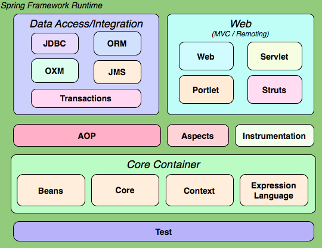
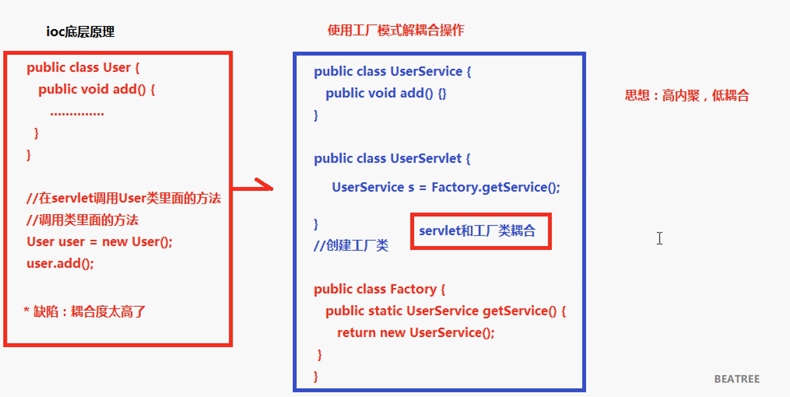
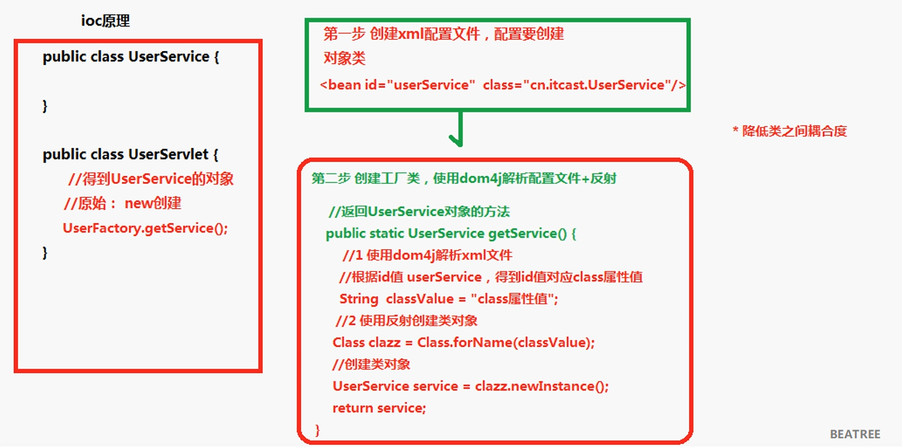

# Spring 学习笔记Day1

## Spring 简介



1. spring 是开源的轻量级框架；
2. spring 核心主要两部分：
    + AOP 面向切面编程，扩展功能不是修改源代码实现；
    + IOC 控制反转，比如有一个类，在类里面有方法（不是静态的方法），调用类里面的方法，创建类的对象，使用对象调用方法，创建类对象的过程需要new出来对象。现在是把对象的创建不是通过new方式实现，而是交给spring配置创建类对象。

3. Spring 是**一站式**框架：
    + spring在javaee三层结构中，每一层都提供不同的解决技术：
        - web 层：      springMVC
        - service 层：  spring ??? ioc
        - dao 层：      jdbcTemplate

## Spring的IOC操作

1. 把对象的创建交给spring进行管理
2. IOC操作两部分：
    + IOC 的配置文件方式
    + IOC 注解方式

### IOC 的底层原理

#### IOC 底层原理使用的技术

1. xml 配置文件
2. dom4j 解析xml
3. 工厂设计模式
4. 反射

#### 底层原理画图分析




### IOC 入门案例

1. 导入 jar 包

2. 创建类，在类里边写方法

3. 创建 spring 配置文件，配置创建类
    + spring 核心配置文件名称和位置是不确定的，默认会在 *src* 目录下生成 `applicationContext.xml`，名称可以随便命名，但是建议使用这个，便于标识
    + Spring的 `schema` 约束

        ```xml
        <beans
        xmlns="http://www.springframework.org/schema/beans"
        xmlns:xsi="http://www.w3.org/2001/XMLSchema-instance"
        xmlns:p="http://www.springframework.org/schema/p"
        xsi:schemaLocation="http://www.springframework.org/schema/beans http://www.springframework.org/schema/beans/spring-beans-4.1.xsd">

        </beans>
        ```

    + 配置对象的创建 `<bean id="user" class="club.teenshare.bean.User"></bean>`

4. 写代码进行测试

    ```java
    @Test
	public void testUser(){
		// 1. 加载 Spring 配置文件，根据配置创建对象
		ApplicationContext context = new ClassPathXmlApplicationContext("applicationContext.xml");
		// 2. 得到配置创建的对象
		User user = (User)context.getBean("user");
		System.out.println(user);
		user.say();
	}
    ```


User.java :

```java
package club.teenshare.bean;

public class User {
	public void say(){
		System.out.println("Hello Spring!");
	}
	
	public static void main(String[] args){
		User user = new User();				// 传统调用方式
		user.say();
	}
}
```

## Spring 的 bean 管理（xml方式）

### Bean 实例化的方式

1. 在 Spring 通过配置文件创建对象

2. bean 实例化的三种实现方式

    1. 使用类的 **无参构造**进行创建(重点) `<bean id="user" class="club.teenshare.bean.User"></bean>`
    2. 使用**静态工厂**进行创建
        + 创建静态的方法返回对象
    3. 使用**实例工厂**进行创建
        + 使用非静态的方法返回所需对象

applicationContext.xml :

```xml
<?xml version="1.0" encoding="UTF-8"?>
<beans
	xmlns="http://www.springframework.org/schema/beans"
	xmlns:xsi="http://www.w3.org/2001/XMLSchema-instance"
	xmlns:p="http://www.springframework.org/schema/p"
	xsi:schemaLocation="http://www.springframework.org/schema/beans http://www.springframework.org/schema/beans/spring-beans-4.1.xsd">

	<!-- ioc 入门 -->
	<!-- 无参方法构造创建 -->
	<bean id="user" class="club.teenshare.bean.User"></bean>
	
	<!-- 使用静态工厂来创建对象; factory-method 指定使用工厂中的哪个方法进行实现 -->
	<bean id="user2" class="club.teenshare.factory.User2Factory" factory-method="getUser2"></bean>
	
	<!-- 使用实例工厂来创建对象 -->
	<!-- 1. 创建工厂对象 -->
	<bean id="user3Factory" class="club.teenshare.factory.User3Factory"></bean>
	<!-- 2. 创建User3对象 -->
	<bean id="user3" factory-bean="user3Factory" factory-method="getUser3"></bean>
	<!-- 使用实例工厂来创建对象结束 -->
</beans>
```

ps: 在 Java 中如果没有写构造方法，则默认是无参构造；若写了则使用指定的构造方法

### Bean 标签常用属性

1. **id 属性**：起名称，id属性值名称任意命名。不能包含特殊符号，根据id值得到配置对象。
2. **class 属性**：创建对象所在类的全路径。
3. **name 属性**：功能和id属性一样的，id属性值不能包含特殊符号，但是在name属性值里面可以包含特殊符号。
4. **scope**：指定bean的作用范围。
	singleton：默认值，单例

	prototype：多例

	request：创建对象把对象放到request域里

	session：创建对象把对象放到session域里

	globalSession：创建对象把对象放到globalSession域里

## 属性注入

1. 创建对象时候，向类里面属性设置值

2. Java中属性注入的方式介绍（**三种方式**）
	1. 使用set方法注入

	```java
	public class User{
		private String name;
		public void setName(String name){
			this.name = name;
		}
	}
	...
	User user = new User();	// 创建对象
	user.setName("BEATREE");
	```
	2. 使用有参数构造注入

	```java
	public class User{
		private String name;
		public User(String name){
			this.name = name;
		}
	}
	...
	User user = new User("BEATREE");
	```
	3. 使用接口注入

	```java
	public interface Dao{
		public void delete(String name);
	}
	public class DaoImpl implements Dao {
		private String name;
		public void delete(String name){
			this.name = name;
		}
	}
	```
3. spring框架里面，支持前两种方式: **set方法注入（重点）**；有参数构造注入

### 使用有参数的构造进行注入

PropertyDemo1.java 

```java
package club.teenshare.property;

public class PropertyDemo1 {
	private String name;
	public PropertyDemo1(String name){
		this.name = name;
	}
	
	public void test(){
		System.out.println("Demo1_________"+name);
	}
}
```

applicationContext.xml

```xml
<!-- 使用有参数的构造进行注入 -->
<bean id="demo" class="club.teenshare.property.PropertyDemo1">
	<!-- 使用有参数构造函数注入 -->
	<constructor-arg name="name" value="BEATREE"></constructor-arg>
</bean>
```

Test.java

```java
// 1. 加载 Spring 配置文件，根据配置创建对象
ApplicationContext context = new ClassPathXmlApplicationContext("applicationContext.xml");
// 2. 得到配置创建的对象
PropertyDemo1 demo1 = (PropertyDemo1)context.getBean("demo");
demo1.test();
-------------------------------
输出结果：Demo1_________BEATREE
```

### 使用set方法注入属性 (!important)

PropertyDemo2.java

```java
package club.teenshare.property;

public class PropertyDemo2 {
	private String demoname;

	public void setDemoname(String demoname){
		this.demoname = demoname;
	}
	
	public void test(){
		System.out.println("Demo1_________"+demoname);
	}
}
```

applicationContext.xml

```xml
<!-- 使用set方法注入属性 -->
<bean id="demo2" class="club.teenshare.property.PropertyDemo2">
	<!-- 注入/设置属性值 
		name 属性值：类里面定义的属性名称
		value属性：设置具体的值
	-->
	<property name="demoname" value="teenshare.club"></property>
</bean>
```


## (重点) 注入对象类型属性

1. 创建 service 类以及 dao 属性
	1. 在 service 中得到 dao 对象

2. 具体实现过程
	1. 在 service 中把 dao 作为类型属性
	2. 生成 dao 的 set 方法
	3. 配置文件中注入关系


UserService.java

```java
package club.teenshare.service;

public class UserService {
//	1. 定义 dao 的对象
	private UserDao userDao;
//	2. 生成 set 方法
	public void setUserDao(UserDao userDao) {
		this.userDao = userDao;
	}
	
	public void add(){
		System.out.println("Now in UserService");
//		之前需要先定义对象，然后才能进行使用方法
//		UserDao ud = new UserDao();
//		ud.function();
		userDao.add();
	}

}
```

UserDao.java

```java
package club.teenshare.service;

public class UserDao {
	public void add(){
		System.out.println("Now in UserDao");
	}
}
```

applicationContext.xml

```xml
<!-- 注入对象类型属性 -->
<!-- 1. 配置 service 和 dao 对象 -->
<bean id="userDao" class="club.teenshare.service.UserDao"></bean>
<bean id="userService" class="club.teenshare.service.UserService">
	<!-- 注入dao对象
			name: 类里边的属性的名称
				* 现在因为是注入的对象，所以不能写 value；而应该是 ref 属性
			ref: dao配置的bean标签中 id 值  -> <bean id="userDao" class="club.teenshare.service.UserDao"></bean>
		-->
	<property name="userDao" ref="userDao"></property>
</bean>
```

## P 名称空间注入

在 xml 配置文件的头部引入 `xmlns:p="http://www.springframework.org/schema/p"` 从而引入p名称空间

```xml
<!-- p 名称空间注入 -->
<bean id="person" class="club.teenshare.property.Person" p:pname="????????????"></bean>
<!-- 如果要注入对象则使用 p:name-ref 注入 -->
```

## 复杂类型的属性注入 Array, List等

Person.java

```java
package club.teenshare.property;

import java.util.Arrays;
import java.util.List;
import java.util.Map;
import java.util.Properties;

public class Person {
	private String pname;
	
	private String[] strA;
	private List<String> strList;
	private Map<String, String> strMap;
	private Properties properties;
	
	public void setStrA(String[] strA) {
		this.strA = strA;
	}

	public void setStrList(List<String> strList) {
		this.strList = strList;
	}

	public void setStrMap(Map<String, String> strMap) {
		this.strMap = strMap;
	}

	public void setProperties(Properties properties) {
		this.properties = properties;
	}

	public void setPname(String pname){
		this.pname = pname;
	}
	
	public void test(){
		System.out.println("In Person ___"+pname);
		System.out.println("array:"+Arrays.toString(strA));
		System.out.println("map:"+strMap.entrySet().toString());
		System.out.println("List:"+strList.toString());
		System.out.println("properties:"+properties);
	}
}

```

applicationContext.xml：

```xml
<!-- 复杂类型的属性注入 -->
<bean id="person" class="club.teenshare.property.Person" p:pname="做棵大树">
	<!-- 数组类型 -->
	<property name="strA">
		<list>
			<value>小花</value>
			<value>小草</value>
			<value>小树</value>
		</list>
	</property>
	<!-- list 类型 -->
	<property name="strList">
		<list>
			<value>小王</value>
			<value>小马</value>
			<value>小李</value>
		</list>
	</property>
	<!-- map -->
	<property name="strMap">
		<map>
			<entry key="a" value="a"></entry>
			<entry key="b" value="b"></entry>
			<entry key="c" value="c"></entry>
		</map>
	</property>
	
	<!-- properties -->
	<property name="properties">
		<props>
			<prop key="diverclass">com.mysql.jdbc.Driver</prop>
			<prop key="username">root</prop>
			<prop key="password">123456</prop>
		</props>
	</property>
</bean>
```

## IOC 和 DI 区别

### What's IOC

IOC(Inversion of Control)：控制反转，把对象创建交给spring进行配置；

### What's DI

DI(Dependency Injection): 向类里面的属性中设置值。

### 二者之间关系

依赖注入不能单独存在，需要在IOC的基础之上完成操作。
