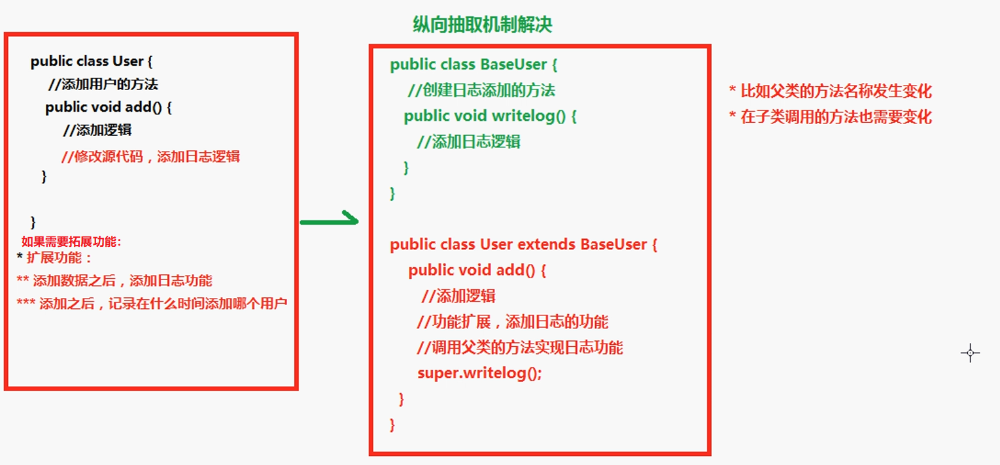
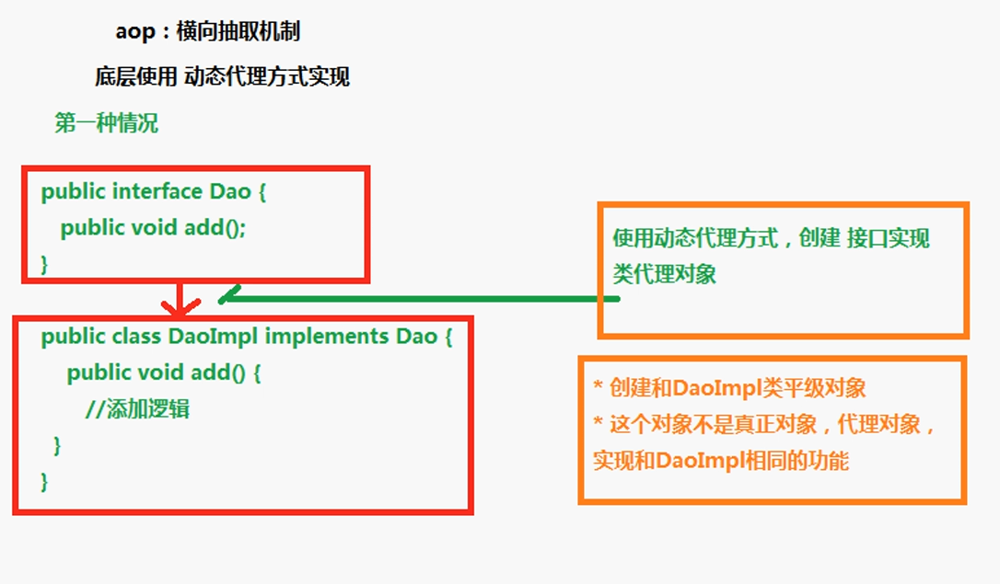
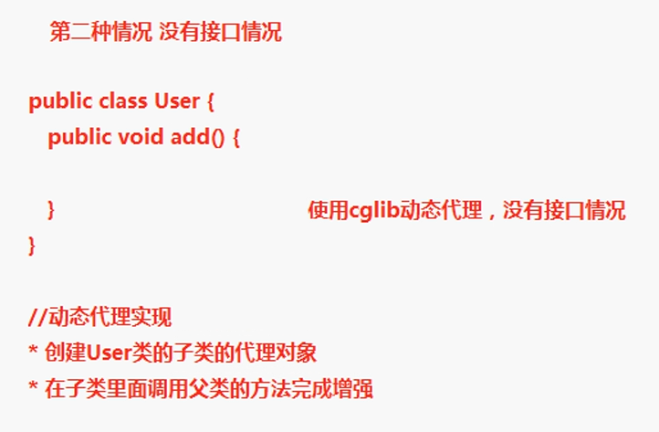

# Spring 学习笔记 Day2.1

## 配置文件和注解混合使用

1. 创建对象操作使用配置文件方式实现
2. 注入属性的操作使用注解方式实现

例子：

创建 BookService, OrderDao, BookDao 三个类；想要在 BookService 类中获得另外两个类的对象。

通过配置文件，进行类的实例的注入：我们在这里新建另一个名为`applicationContext2.xml`；同样由于我们和注解一同使用，我们也要引入并开启注解扫描。

```xml
<?xml version="1.0" encoding="UTF-8"?>
<beans
	xmlns="http://www.springframework.org/schema/beans"
	xmlns:xsi="http://www.w3.org/2001/XMLSchema-instance"
	xmlns:p="http://www.springframework.org/schema/p"
	xmlns:context="http://www.springframework.org/schema/context"
	xsi:schemaLocation="http://www.springframework.org/schema/beans http://www.springframework.org/schema/beans/spring-beans-4.1.xsd	http://www.springframework.org/schema/context http://www.springframework.org/schema/context/spring-context.xsd">

	<!-- 开启注解扫描
		1. 到包所包含的类中进行扫描类，方法，属性上是否有注解存在
	 -->
	 <context:component-scan base-package="club.teenshare"></context:component-scan>
	 
	 <!-- 配置对象  -->
	 <bean id="bookService" class="club.teenshare.service.BookService"></bean>
	 <bean id="bookDao" class="club.teenshare.service.BookDao"></bean>
	 <bean id="orderDao" class="club.teenshare.service.OrderDao"></bean>
</beans>
```

然后，我们在 `BookService.java` 类中进行注解定义：

```java
public class BookService {
	//得到 BookDao 以及 OrderDao 的对象
	@Resource(name="bookDao")
	private BookDao bookDao;
	
	@Resource(name="orderDao")
	private OrderDao orderDao;
	
	public void add(){
		System.out.println("service........");
		bookDao.book();
		orderDao.buy();
	}
}
```

注意：这里 `@Resoure(name="?")` 中的 name 的值需要同配置文件中的 `id` 名称一致

另外两个 java 类文件则无需在修改，他们已经在 xml 文件中完成了配置。然后我们就可以通过 ApplicationContext 进行使用了。

```java
@Test
public void test(){
    ApplicationContext context = new ClassPathXmlApplicationContext("applicationContext2.xml");
    BookService bookService = (BookService)context.getBean("bookService");
    bookService.add();
}
```

## AOP 概念

AOP (Aspect Oriented Programming): 面向切面（方面）编程，拓展功能不修改源代码实现。

AOP 采用**横向抽取机制**，取代了传统纵向继承体系的重复性代码。

## AOP 原理

最开始的处理方式和纵向抽取机制


aop 横向抽取机制：有接口的情况


aop 横向抽取机制：无接口的情况


### Spring的AOP的底层实现

Spring的AOP的底层用到了两种代理机制：

1. `JDK`的动态代理：针对实现了接口的类产生代理。
2. `Cglib`的动态代理：针对没有实现接口的类产生代理，应用的是底层的字节码增强的技术，生成当前类的子类对象。


## AOP操作术语

1. **Joinpoint(连接点)**：所谓连接点是指那些被拦截到的点。在Spring中，这些点指的是方法，因为Spring只支持方法类型的连接点。

2. ⭐**Pointcut(切入点)**：所谓切入点是指我们要对哪些Joinpoint进行拦截的定义。
3. ⭐**Advice(通知/增强)**：所谓通知是指拦截到Joinpoint之后所要做的事情就是通知。通知分为前置通知、后置通知、异常通知、最终通知和环绕通知(切面要完成的功能)。
4. ⭐**Aspect(切面)**：是切入点和通知的结合。
5. **Target(目标对象)**：代理的目标对象(要增强的类)
6. **Weaving(织入)**：是指把增强应用到目标对象来创建新的代理对象的过程。Spring采用动态代理织入，而AspectJ采用编译期织入和类装载期织入。
7. **Proxy(代理)**：一个类被AOP织入增强后，就产生一个结果代理类。
8. **Introduction(引介)**：引介是一种特殊的通知在不修改类代码的前提下，Introduction可以在运行期为类动态地添加一些方法或Field。

为了便于理解，我们假设有一个类：

```java
public class User {
    public void add() {

    }

    public void update() {

    }

    public void delete() {

    }
}
```

+ **Joinpoint 连接点**：在User类里面有3个方法，这3个方法都可以被增强，类里面的哪些方法*可以被增强，这些方法就可被成为连接点*。

+ **Pointcut 切入点**：在一个类中可以有很多的方法被增强，在实际操作中，如若只增强了类里面的add方法，则*实际增强的方法被称为切入点*。

+ **Advice 增强/通知**：比如增强User类里面的add方法，在add方法中添加了日志功能，这个日志功能就称为增强。

    通知类型：

    + 前置通知：在增强的方法执行之前进行操作。
    + 后置通知：在增强的方法执行之后进行操作。
    + 异常通知：程序出现异常之后执行的通知。
    + 最终通知：增强了两个方法，执行第一个方法，执行第二个方法，在第二个方法执行之后进行操作。

        也可理解为后置通知后面执行的通知或者无论目标方法是否出现异常，*最终通知都会执行*。
    + 环绕通知：在增强的方法*执行之前和执行之后*进行操作。

+ **Aspect 切面**：把增强**应用到切入点的过程**。即把具体增强的逻辑用到具体的方法上面的过程。

+ **Introduction 引介**：引介是一种特殊的通知，在不修改类代码的前提下，引介在运行期间为类动态的添加一些方法或 字段

+ **Target 目标对象**：增强的方法所在的类，*即要增强的类*。

+ **Weaving 织入**：是指把增强**应用到目标对象的过程**。即把advice应用到target的过程。

