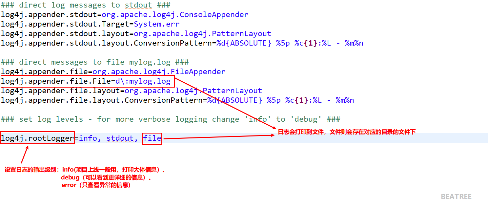

# log4j 介绍

## 作用介绍

通过 log4j 可以看到程序运行过程中更详细的信息。

+ 经常使用 log4j 查看日志


## 如何使用 log4j

1. 导入 log4j 的 jar 包
2. 复制 log4j 的配置文件到 src 下

    log4j.properties 配置文件

    ```properties
    ### direct log messages to stdout ###
    log4j.appender.stdout=org.apache.log4j.ConsoleAppender
    log4j.appender.stdout.Target=System.err
    log4j.appender.stdout.layout=org.apache.log4j.PatternLayout
    log4j.appender.stdout.layout.ConversionPattern=%d{ABSOLUTE} %5p %c{1}:%L - %m%n

    ### direct messages to file mylog.log ###
    log4j.appender.file=org.apache.log4j.FileAppender
    log4j.appender.file.File=d\:mylog.log
    log4j.appender.file.layout=org.apache.log4j.PatternLayout
    log4j.appender.file.layout.ConversionPattern=%d{ABSOLUTE} %5p %c{1}:%L - %m%n

    ### set log levels - for more verbose logging change 'info' to 'debug' ###

    log4j.rootLogger=info, stdout, file
    ```

3. 设置日志级别

    `log4j.rootLogger=info, stdout, file`

    （1）info：看到基本信息

    （2）debug：看到更详细的信息

