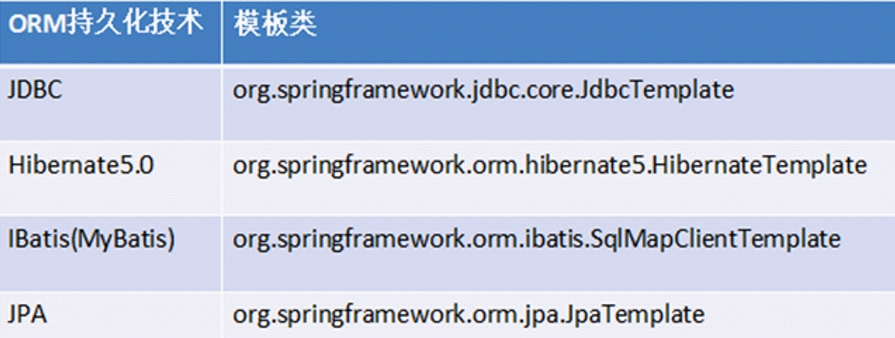

# Spring 学习笔记 Day3.0

## Spring 的 jdbcTemplate 操作

Spring是一个分层的JavaSE/EEfull-stack(一站式)轻量级开源框架。

它针对JavaEE三层中的每一层都提供了不同的解决技术，在持久层，Spring提供了JDBC模板的技术，可对数据库进行`CRUD`操作。

Spring提供了很多持久层技术的模板类简化了编程，如下图：



jdbcTemplate 对 JDBC 进行了简单封装，使用**类似于dbutils**，但是**使用并没有dbutils方便**，只是提供了一种实现的方式而已。

---

> 在进行以下操作之前，我们肯定首先需要有一个数据库；操作数据库另外还需要**数据库驱动的jar包** 

1. 使用JdbcTemplate模板类还须导入jar包，先引入JdbcTemplate的jar包：`spring-jdbc-*.jar` 以及 `spring-tx-*.jar`
2. 创建对象，设置数据库信息
3. 创建 jdbcTemplate 对象，设置数据源
4. 调用 jdbcTemplate 对象里边的方法实现操作

### 增加

```java
@Test
public void add(){
    //2. 创建对象，设置数据库信息
    DriverManagerDataSource dataSource = new DriverManagerDataSource();
    dataSource.setDriverClassName("com.mysql.jdbc.Driver");
    dataSource.setUrl("jdbc:mysql:///chatroom");
    dataSource.setUsername("root");
    dataSource.setPassword("123456");
    //3. 创建 jdbcTemplate 对象，设置数据源
    JdbcTemplate jdbcTemplate = new JdbcTemplate(dataSource);

    //4. 调用 jdbcTemplate 对象里边的方法实现操作
    // 创建 sql 语句
    String sql = "INSERT INTO USER (username, password, type) VALUES (?,?,?)";
    int rows = jdbcTemplate.update(sql, "BEATREE", "123456","user");
    System.out.println("影响的行数是"+rows);
}
```

其中 `jdbcTemplate.update(sql, "BEATREE", "123456","user");` 的返回值是这个代码影响的行数。

### 修改

```java
@Test
public void update(){
    //2. 创建对象，设置数据库信息
    DriverManagerDataSource dataSource = new DriverManagerDataSource();
    dataSource.setDriverClassName("com.mysql.jdbc.Driver");
    dataSource.setUrl("jdbc:mysql:///chatroom");
    dataSource.setUsername("root");
    dataSource.setPassword("123456");
    //3. 创建 jdbcTemplate 对象，设置数据源
    JdbcTemplate jdbcTemplate = new JdbcTemplate(dataSource);
    // 调用实现
    String sql = "UPDATE user SET password=? WHERE username=?";
    int rows = jdbcTemplate.update(sql, "BEATREE", "BEATREE");
    System.out.println("影响的行数是"+rows);
}
```

调用方法相同，主要是 sql 语句写的时候需要注意。

### 删除

```java
// 3.删除操作
@Test
public void delete() {
    // 1.设置数据库相关信息
    DriverManagerDataSource dataSource = new DriverManagerDataSource(); // 数据源
    dataSource.setDriverClassName("com.mysql.jdbc.Driver");
    dataSource.setUrl("jdbc:mysql:///chatroom");
    dataSource.setUsername("root");
    dataSource.setPassword("123456");

    // 实现删除操作
    JdbcTemplate jdbcTemplate = new JdbcTemplate(dataSource);
    String sql = "DELETE FROM user WHERE username=?";
    int rows = jdbcTemplate.update(sql, "liayun");
    System.out.println("影响的行数是"+rows);
}
```

### 查询

#### 普通查询

现在要在单元测试类中编写一个`getCount`方法来测试查询表中记录数的操作。

```java
// 查询表记录数
@Test
public void getCount() {
    // 1.设置数据库相关信息
    DriverManagerDataSource dataSource = new DriverManagerDataSource(); // 数据源
    dataSource.setDriverClassName("com.mysql.jdbc.Driver");
    dataSource.setUrl("jdbc:mysql:///spring_lee");
    dataSource.setUsername("root");
    dataSource.setPassword("123456");

    // 2.创建JdbcTemplate模板类的对象
    JdbcTemplate jdbcTemplate = new JdbcTemplate(dataSource);
    // 3.sql语句
    String sql = "SELECT count(*) FROM user";
    // 4.调用JdbcTemplate模板类里面的方法
    // 返回int类型
    int count = jdbcTemplate.queryForObject(sql, Integer.class);
    System.out.println(count);
}
```

`jdbcTemplate.queryForObject(sql, Integer.class);` 在这个语句中，我们有两个参数：

+ 第一个参数：sql语句
+ 第二个参数：返回类型的**class**

#### 对象查询

使用JdbcTemplate模板类进行查询操作的时候，还是比较麻烦的。

> 前面也提到过 JdbcTemplate 对 JDBC 进行了简单封装，使用类似于 dbutils，但是使用并没有 dbutils 方便，只是提供了一种实现的方式而已。

为何这么说呢？因为在dbutils里面帮我们编写好了一些实现类，使用这些实现类可以封装结果，这些实现类都实现了接口ResultSetHandler；

使用 JdbcTemplate 模板类进行查询操作返回数据结果的时候，虽然在 JdbcTemplate 模板类中有个接口，但是**并没有提供实现类**，故*还需要自己编写实现类*来封装。

用到的方法是：`queryForObject(String sql, RowMapper<User> rowMapper, Object... args) ;`

这个方法有3个参数：

+ 第一个参数：sql语句
+ 第二个参数：RowMapper接口

    之前使用dbutils进行查询时，返回结果有ResultSetHandler接口，但是在dbutils里面有其对应的实现类。

    使用JdbcTemplate模板类的时候，虽然提供了RowMapper接口，但是这个接口没有实现类，需要自己进行实现，然后进行数据封装。

+ 第三个参数：可变参数

```java
// 查询返回对象
@Test
public void getBean() {
    // 1.设置数据库相关信息
    DriverManagerDataSource dataSource = new DriverManagerDataSource(); // 数据源
    dataSource.setDriverClassName("com.mysql.jdbc.Driver");
    dataSource.setUrl("jdbc:mysql:///chatroom");
    dataSource.setUsername("root");
    dataSource.setPassword("123456");

    // 2.创建JdbcTemplate模板类的对象
    JdbcTemplate jdbcTemplate = new JdbcTemplate(dataSource);
    // 3.sql语句
    String sql = "SELECT * FROM user WHERE username=?";
    // 4.调用JdbcTemplate模板类里面的方法
    // 第二个参数是接口RowMapper，需要自己写类实现接口，自己做数据封装；可以写匿名内部类
    User count = jdbcTemplate.queryForObject(sql, new MyRowMapper(),"BEATREE");
    System.out.println(count);
}
```

由于为为实现接口，我们还需要编写 RowMapper 接口的一个实现类。我们取名叫做 MyRoWMapper；当然，我们也可以直接编写一个**匿名内部类用于完成操作。

```java
class MyRowMapper implements RowMapper<User>{

	@Override
	public User mapRow(ResultSet rs, int num) throws SQLException {
		//1 得到结果集中的值
		String username = rs.getString("username");
		String password = rs.getString("password");
		//2 放到User对象中
		User user = new User();
		user.setUsername(username);
		user.setPassword(password);
		
		return user;
	}
}
```

#### 列表查询

```java
// 2.返回List集合
@Test
public void testList() {

    // 1.设置数据库相关信息
    DriverManagerDataSource dataSource = new DriverManagerDataSource(); // 数据源
    dataSource.setDriverClassName("com.mysql.jdbc.Driver");
    dataSource.setUrl("jdbc:mysql:///chatroom");
    dataSource.setUsername("root");
    dataSource.setPassword("123456");

    // 2.查询操作
    JdbcTemplate jdbcTemplate = new JdbcTemplate(dataSource);
    String sql = "select * from user";

    List<User> list = jdbcTemplate.query(sql, new MyRowMapper());
    System.out.println(list);

}
```

在进行查询并返回List集合的操作时，须用到JdbcTemplate模板类里面的query方法：

`query(String sql, RowMapper<T> rowMapper)` 或者 `query(String sql, RowMapper<T> rowMapper, Object... args)`
