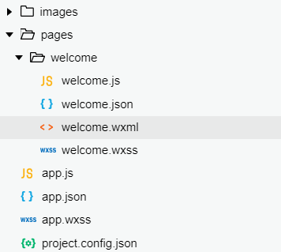

# 从一个简单的“欢迎“页面开始

> 学习哪些
>
> + 小程序的文件类型和目录结构
> + 注册小程序页面，View、Image、Text等组件的基本用法
> + Flex弹性盒子模型
> + 移动分辨率以及小程序自适应单位RPX

## 文件目录和类型

*pages* 目录中的每一个目录就是代表了一个页面，页面由不同的文件组成：`*.js`, `*.json`, `*.wxml`, `*.wxss`

1. wxml: 类似于html的页面文件
2. wxss: 类似于css样式文件
3. js  : 页面的逻辑文件
4. json: json数据或配置文件

其中特殊的有：

1. app.js: 应用程序级别的逻辑文件
2. app.json: 应用程序级别的配置
3. app.wxss: 应用程序级别的样式（全局的样式）

自己的配置文件会覆盖全局的配置文件。

utils文件夹中是小的工具类，主要是用来告诉用户可以这样写一些小的函数组件的。

页面有级别之分，最高为应用程序级别，而后有逐级的划分，一级，二级一直到五级，因为小程序讲究轻便所以不建议页面过多或页面层数过多，目前项目体积不能超过2MB。

如果体积会超过2MB，需要通过**分包加载**进行


## Welcome欢迎页面

从一个空白项目开始，首先需要新建应用程序级别的文件即 `app.*`，而后在 `pages` 目录下新建`welcome`页面目录进行页面的创建.

小程序如何寻找页面文件，如何确定显示哪一个页面文件？

answer1: 在pages中进行寻找
answer2: pages数组中的第一个为默认页面

## 认识小程序的 rpx

rpx是什么单位呢？

rpx是自适应的一个宽度单位，目的是为了让图片可以随机型的变化，进行变化从而实现自适应。如果是使用 px 作为单位，建议在 iPhone 6下进行设计，因为只有在iPhone6下rpx和px的换算单位才是 2:1，其他情况下不好换算。

## flex 布局

flex布局，也成为弹性盒子，微信小程序常用这种样式来进行布局。简单来说，flex是个相对容器布局，里面可以放很多组件也可以嵌套容器。flex布局一共有6个属性：

+ flex-direction：决定主轴的方向(即项目的排列方向)
+ flex-wrap：决定容器内项目是否可换行
+ flex-flow： flex-direction 和 flex-wrap 的简写形式
+ justify-content：定义了项目在主轴的对齐方式。
+ align-items：定义了项目在交叉轴上的对齐方式
+ align-content：定义了多根轴线的对齐方式，如果项目只有一根轴线，那么该属性将不起作用

同时，我们需要注意我们的页面文件，虽然我们编写的时候是从`view`开始，但是微信在最底层加入了 `page` 标签进行包括，所以最底层的是page标签。

编写完成后的代码结构如下：



（出于代码样式考虑，代码格式指定为对应的前端格式显示）

`welcome.wxml`:

```html
<view class="container">
  <image class="user-avatar" src="/images/avatar.png"></image>
  <!-- 图片大小有默认值，默认宽度300px，高度220px -->
  <text class="user-name">hello, 大树</text>
  <view class="moto-container">
    <text class="moto">Hello World !</text>
  </view>
</view>
```

`welcome.wxss`

```css
.user-avatar {
  width: 200rpx;
  height: 200rpx;
  margin-top:180rpx;
}

/* flex布局 弹性盒子模型 */
page{
  background-color: #b3d4db;
  height: 100%;
}
.container{
  display: flex;
  flex-direction: column;
  align-items: center;
}

.user-name{
  font-size: 32rpx;
  font-weight: bold;
}

.moto{
  color: #405f80;
  font-size: 22rpx;
  font-weight: bold;
  line-height: 80rpx;
}

.moto-container {
  margin-top: 200rpx;
  border: 1px solid #405f80;
  height: 80rpx;
  width: 200rpx;
  border-radius: 5px;
  text-align: center;
}
```
