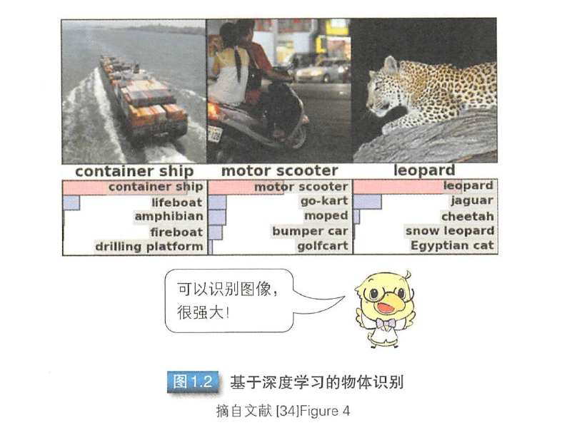

# 第一章 绪论

## 1.1 深度学习与机器学习

深度学习（Deep Learning. 后续可能会直接使用 *DL* 简写）是一种机器学习（Machine Learning. 简写 ML *可不是 mak\* lo\*e 哦*）方法。现在机器学习的广义概念是指从已知数据中获得规律，并利用规律对未知数据进行预测的方法。

机器学习是一种统计学习方法，需要使用大量数据进行学习，主要分为**有监督学习**和**无监督学习**两种。

有监督学习需要基于输入数据及其期望输，通过训练从数据中提取通用信息或特征信息（特征值），以此得到预测模型。这里的特征值是指根据颜色和边缘等人为定义的提取方法从训练样本中提取的信息（图1.1）。

无监督学习无需期望输出，算法会向动从数据中提取特征值。

DL 对有监督学习和去监督学习两种学习方法都会使用。DL 是一种多层次网络结构，与人脑的认知结构相似。

## 1.2 DL 发展历程

> 直接摘自原文

深度学习井非一项横空出世的新技术， 而是在出现了一系列的案例研究报告后，才受到万众瞩目。这里首先要介绍的是 2011 年语音识别领域的研究报告。在以往的语音识别中，使用高斯混合模型
(*Gaussian Mixture Model, GMM* ） 和隐马尔可夫模型（*Hidden Markov Model, HMM* ） 的方法被普遍应用， 人们争相改良这些方法，以期语音识别的性能能够在接近性能极限的有限范围内得到些许提升。而深度学习方法直接打破了原有的性能极限，使语音识别的性能得到大幅提高，并于2011 年的基准测试中达到顶级。

深度学习的洪流也席卷了图像识别领域。在图像识别领域，每年都会举办物体识别竞赛。以往的图像识别普遍使用尺度不变特征变换（*Scale-Invariant Feature Transform , SIFT* ）、视觉词袋模型（*Bag of Visual Words, BoVW* ）特征表达以及费舍尔向量（*Fishier Vector,FY* ）等尺度压缩方法。这里， 深度学习方法的引人再次打－破了原有方法
的性能壁垒，使性能得到大幅提升（ 图1.2 ) 。由此，深度学习在图像识别领域的有效性得到确定，其自身也被广泛应用。

同时期， Google 开发的自动学习方法通过深度学习实现了猫脸识别，这使得深度学习变得广为人知（图1.3 ）。Google 使用的是无监督学习的方法，向计算机展示YouTube 上的视频后，系统能够自动获取对“猫脸”产生强烈反应的特定神经元。这个过程与婴儿识别物体并记住物体名称的过程一致。除猫脸外，这种学习方法也能自动获取对人脸做出反应的神经元。

Google 收购的 DeepMind 公司也提出了一种自动学习方法一一在设置游戏任务后，机器能够向动学习如何操作才能得到高分。这种方法被科学杂志 Nature 刊载一一这在人工智能研究中具有划时代的意义。

深度学习之所以能吸引众多领域的关注，也得益于人们可以非常轻松地获取大量训练数据，多种性能提升方法的出现，以及GPU 和内存等硬件的进步，这些因素完美地结合到了一起。由于互联网的普及以及高速通信环境的逐步完善，人们能够从互联网上获取大量公开的图像数据。目前用于图像识别的数据集中包含了数百万张图像，用于语音识别的数据集中也包含了数百小时的语音数据。为了提升’性能，人们提出了 **Dropout** 等防止过拟合的方法，为了使训练过程顺利收敛，人们又提出了**激活函数** 和**预训练方法**等，这些方法对深度学习的性能提升起到了支撑作用。

而硬件的进步主要体现在GPU 的问世，其高性能为深度学习的飞跃性发展提供了硬件支撑。GPU 是图形处理器（ Graphics Processmg Unit ） 的简称， 专门用在游戏或图形软件等图形处理单元（图1.4 ）。GPU 中集成了大量计算单元，能够提供并行运算的能力。目前，NVIDIA 就提供了一种名为 CUDA 的并行计算编程环境，而 NVIDIA 的GPU 包括面向大众的GeForce 系列和面向科学计算的 Tesla 系列， 以及面向嵌入式的 GPU 主板 Tegra 系列。处理时间长是深度学习的一个主要问题， 而 CUDA 支持并行处理，不仅可以帮助 GPU 大幅缩短处理时间，还能提供面向深度学习的快速计算库。特别是最近几年，随着 GPU 处理能力的飞速进步，在2012 年需要1个月才能完成的深度学习训练，在2015 年只需几天即可完成。在这样的背景下，深度学习的发展恰逢其时，将会引发进一步的革新和发展。

## 为什么是深度学习

以往的机器学习需要人为设计特征值，而深度学习则是通过学习大量数据自动确定需要提取的特征信息，甚至可以发现一些人类无法认知的特征信息。因此深度学习可以帮助我们解决难度系数更高的问题。

## 什么是深度学习

“深度学习”只是个概念性的描述。实际深度学习通常指具有多层结构的网络，不过对于网络的层数没有严格定义，网络生成方法也是多种多样。深度学习的分类方法有很多种，按照起源分类的结果如图1.6 所示。

深度学习的起源包括**感知器**和**玻尔兹曼机** 。起源于“感知器”的深度学习中，最基本的结构是把多个感知器组合到一起得到的多层感知器。

在多层感知器的基础上加入类似人类视觉皮质的结构而得到的卷积神经网络被广泛应用于图像识别领域。

起源于“基于图模型的玻尔兹曼机”的深度学习中，深度玻尔兹曼机以及深度信念网络是通过把多个受限玻尔兹曼机组合到一起而得到的。

**起源于感知器的深度学习是一种有监督学习**，根据期望输出训练网络；而**起源于受限玻尔兹曼机的深度学习是一种无监督学习**，只根据特定的训练数据训练网络。

