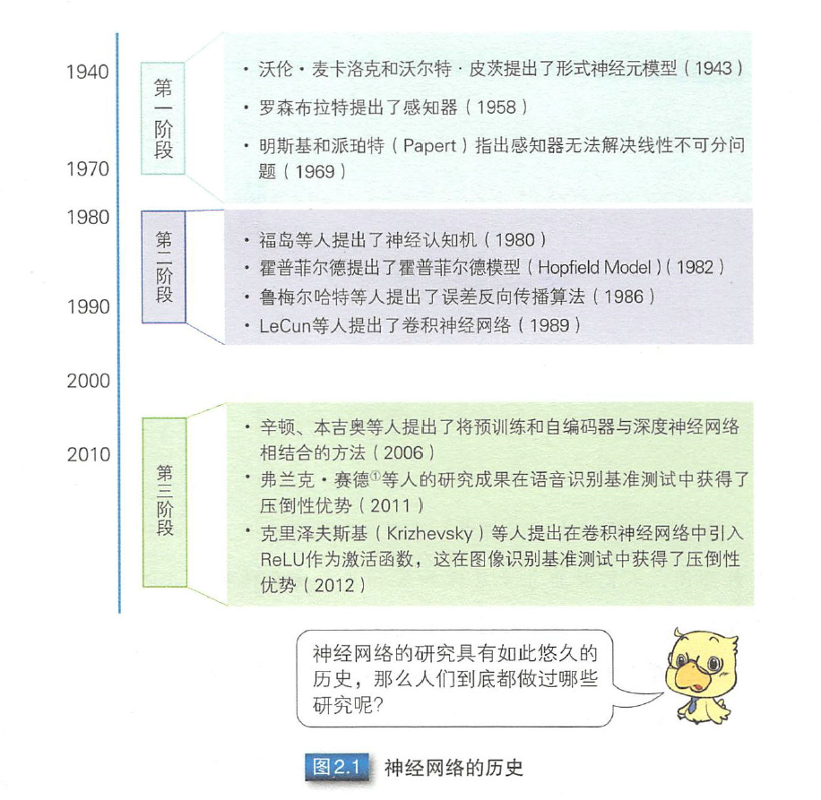
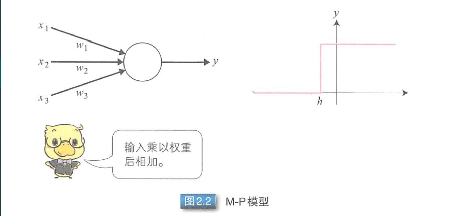

# 第二章 神经网络

## 神经网络的历史

接下来的小结，将顺序介绍历史背景下的神经网络。

## 2.2 M-P 模型

> M-P模型为首个模仿神经元的模型。

如上图所示，在 M-P 模型中，多个输入节点｛x~i~ | i= 1, .. ,n｝对应一个输出节点 y 。每个输入 x~i~ 乘以相应的连接权重 w~i~，然后相加得输出 y。结果之和如果大于阈值 h ，则输出1， 否则输出 0 。输入和输出均是 0 或 1。

$y=f\left(\sum_{i=1}^{n} w_{i} x_{i}-h\right)$    (2.1)