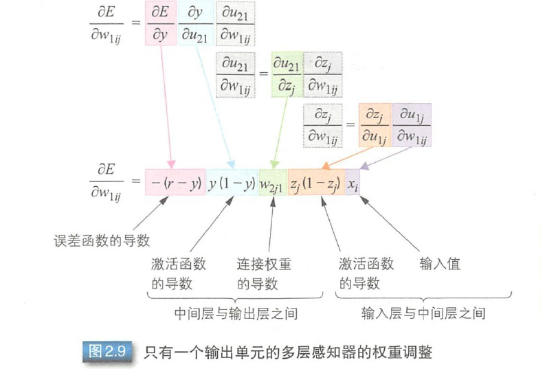

# 第二章 神经网络

## 2.1 神经网络的历史

接下来的小结，将顺序介绍历史背景下的神经网络。

## 2.2 M-P 模型

> M-P模型为首个模仿神经元的模型。

如上图所示，在 M-P 模型中，多个输入节点｛x~i~ | i= 1, .. ,n｝对应一个输出节点 y 。每个输入 x~i~ 乘以相应的连接权重 w~i~，然后相加得输出 y。结果之和如果大于阈值 h ，则输出1， 否则输出 0 。输入和输出均是 0 或 1。

M-P 模型可以表示 AND / OR /NOT 等逻辑运算。

使用逻辑或（OR）和逻辑与（AND）可以使用图 2.3.b 来进行表示双输入单输出的M-P模型。当取 *w~1~* = 1， *w~2~* = 1, *h* = 0.5 时，带入公式（2.1）可得。

*y=f(x~1~+x~2~-0.5)*    (2.2)

---

下表为逻辑 AND OR 运算关系

## 2.3 感知器

罗森布拉特提出的**感知器**能够根据训练样本向动获取样本的组合 。与 M-P 模型需要人为确定参数不同，感知器能够**通过训练自动确定参数**。

训练方式为：有监督学习；需要设定训练样本与期望输出，然后调整实际输出与期望输出之差的公式（误差修正学习）。误差修正学习可用公式（ 2.4 ）和 (2.5 ）表示。

α 是确定连接权重调整值的参数。α 增大则误差修正速度增加， α 减小，则误差修正速度降低。

<small>α 可以看作是学习率，用于控制调整速度，太大会影响训练的稳定性，太小则会使学习次数过多</small>

感知器中调整权重的基本思路如下所示。（ y 实际输出。 r 期望输出）

+ y == r, *w~i~* 和 *h* 不变
+ y != r, 调整 *w~i~* 与 *h*

参数 *w~i~* 和 *h* 的调整包括下面两种情况

1. 实际输出 y = 0、期望输出 r = 1 时 （未激活）
   + 减小 h
   + 增大 *x~i~* = 1 的连接权重 *w~i~*
   + *x~i~* = 0 的连接权重不变
2. 实际输出 y = 1、期望输出 r = 0 时 （激活过度）
   + 增大 h
   + 降低 *x~i~* = 1 的连接权重 *w~i~*
   + *x~i~* = 0 的连接权重不变

训练过程见下图。

因为感知器会利用随机数来初始化各项参数，所以训练得到的参数可能并不相同。

> **线性不可分问题**: 无法用一条直线将两个类别区分开。

误差修正学习可以自动获取参数，这是很大的进步。但是感知器只能解决线性可分问题，儿无法解决线性不可分问题。

如果要解决线性不可分问题，我们需要使用多层感知器。

## 2.4 多层感知器

上一个小节提到了线性不可分问题，为了解决该问题及更复杂的问题，人们提出了 **多层感知器模型**(Multilayer Perceptron)。

> **多层感知器**：指由多层结构的感知器递阶组成的输入值向前传播的网络，也被称为**前馈网络** 或 **正向传播网络**。

如图2.5，多层感知器通常采用三层结构，由 **输入层**、**中间层**与 **输出层**组成。与公式（2.1）中的 MP模型相同，中间层的感知器通过权重与输出层的各个单元（unit）相连接，通过阈值函数计算出中间层个单元的输出值。中间层-输出层同样通过该方式连接。

如何确定各层之间的连接权重 *w~i~* 呢？

多层感知器也可以像单层感知器一样，通过误差修正学习确定两层之间的连接权重。误差修正学习是根据输入数据的期望输出和实际输出之间的误差来调整连接权重，但是不能跨层调整，所以无法进行多层训练。

在初期的多层感知器中，人们使用随机数确定输入层与中间层之间的连接权重，只对中间层与输出层之间的连接权重进行误差修正学习。所以，就会出**现输入数据虽然不同，但是中间层的输出值却相同**，以至于无法准确分类的情况。

那么，多层网络中应该如何训练连接权重呢？人们提出了**误差反向传播算法**。

## 2.5 误差反向传播算法

误差反向传播算法是通过比较实际输出和期望输出，得到误差信号，把误差信号从输出层逐层向前传播得到各层的误差信号，再通过调整各层的连接权重以减小误差。

传播方式为：从后向前，输出 -> 中间 -> 输入

权重的调整主要使用**梯度下降法**（ gradient descent method ）。如图2.6 所示，通过实际输出和期望输出之间的误差 *E* 和梯度，确定连接权重 *W^0^* 的调整值，得到新的连接权重 *W^1^* 。然后像这样不断地调整权重以便误差达到最小，从中学习得到最优的连接权重 *W^opt^* 。这就是梯度下降法。

误差和权重调整值的计算方法。

**计算误差**：可以使用**最小二乘误差函数**（参照公式2.43）。通过期望输出 *r* 和网络的实际
输出 *y* 计算最小二乘误差函数 *E*。 *E* 趋近于0 ，表示实际输出与期望输出更加接近。所以，多层感知器的训练过程就是不断调整连接权重 *W*，以使最小二乘误差函数数趋近于0。

<small>后续也会出现该公式</small>

**调整权重值**：根据梯度下降法，我们时是需要不断进行调整权重值的，以使最小二乘误差函数趋于0。对误差函数求导就能得到图2.6中给定点的梯度，即，**可在误差大时增大调整值，误差小时减小调整值**，所以连接权重调整值 *Δw* 可以用公式（2.6）表示。

其中 *η* 表示学习率（学习率决定参数移动的步长，如果步长过大，很可能越过最优值，而步长过小则可能使得收敛速度过慢）。这个值用于根据误差的程度进行权重调整。

通过误差反向传播算法调整多层感知器的连接权重时，一个瓶颈问题就是激活函数。M-P 模型中使用`step` 函数作为激活函数，只能输出 0 或 1 ，不连续所以不可导。为了使误差能够传播，鲁梅尔哈特等人提出使用可导函数 sigmoid 作为激活函数 *f(u)*.

接下来以单层感知器为例进行说明。根据复合函数求导法则，误差函数求导如下图所示。

设 *y=f(u)*，求误差函数 E 对 *w~i~* 的导数。

*u* 对 *w~i~* 求导的结果之和 *x~i~* 相关，如下所示：

将公式（2.10）代入（2.9），得到下式

这里，对 sigmoid 函数求导。

把公式（2.12）代人公式（2.11 ）中，得到下式。

由于 *y=f(u)* 间，可以计算出单层感知器的权重调整值，如下所示。

我们来看一下图2.7 所示的多层感知l器。多层感知器的误差函数 E 等于各输出单元的误差总和，如下所示。

<small>公式（2.15）添加 1/2 是为了对 E 的 *(r~j~ - y~j~)^2^* 求导时不产生多余的系数</small>

对误差函数求导。

*w~ij~* 表示 *x~i~* 和 *y~j~* 之间的连接权重，对 E 求导的结果只和 *y~i~* 相关，如下所示。

像之前一样，我们对 2.17 展开进行求导。得到

下面就和单层感知器一样，对误差函数求导。

权重值调整如下

由上可知，多层感知器中，只需使用与连接权重*w~ij~* 相关的输入 *x~i~* 和输出 *y~j~* ，即可计算连接权重调整值。

---

下面再来看一下包含中间层的多层感知器。首先是只有一个输出单元 y 的多层感知器，如图2.8 所示。

> *w~1ij~* 表示输入层与中间层之间的连接权重， *w~2j1~* 表示中间层与输出层之间的连接权重。i 表示输入层单元， j 表示中间层单元。

首先来调整中间层与输出层之间的连接权重。和上面的步骤一样，把误差函数 E 对连接权重 *w~2j1~* 求导展开成复合函数求导。

与单层感知器一样，对误差函数求导。

这里， *z~j~* 表示的是中间层的值。于是，连接权重调整值如下所示。

接下来调整输入层与中间层之间的连接权重。输入层与中间层之间的连接权重调整值是根据输出 层的误差函数确定的，求导公式如下所示。

与中间层与输出层之间的权重调整值的计算方法相同，输出 y 也是把公式展开后进行复合函数求导。与前面不同的是，这里是中间层与输出层单元之间的激活值 *u~21~* 对输入层与中间层之间的连接权重 *w~1ij~* 求导。*u~21~*由中间层的值马和连接权重 *W~2j1~* 计算得到。对 *z~j~* 导可以得到下式。

接下来，按照前面的说明展开公式（2.24） 。公式（2.26）是中间层与输出层单元之间的激活值*u~21~* 对中间层的值 *z~j~* 求导，结果只和连接权重 *w~2il~* 相关。

下面是中间层的值 *z~j~* 对连接权重 *W~1ij~* 求导。

和y 一样，*z~j~* 也是 sigmoid 函数，对 *z~j~* 求导，得到下式。

下面是输入层与中间层单元之间的激活值 *u~1j~* 对中间层与输出层之间的连接权重 *w~1ij~* 求导，结果只和 *x~i~* 相关。

这样就完成了对公式中所有单元及连接权重的求导。根据公式(2.26）～（2.29），公式（2.25）的结果如下所示。

根据公式（2.24）和（2.30），对输入层与中间层之间的连接权重 *w~1ij~* 求导。

最后得到的中间层与输出层之间的连接权重调整值如下所示。

得到的输入层与中间层之间的连接权重调整值如下所示。

上述步骤的汇总结果如图2.9 所示。由此可见，权重调整值的计算就是对误差函数、激活函数以及连接权重分别进行求导的过程。把得到的导数合并起来就得到了中间层与输出层之间的连接权重。而输入层与中间层之间的连接权重继承了上述误差函数和激活函数的导数。所以，对连接权重求导就是对上一层的连接权重、中间层与输入层的激活函数以及连接权重进行求导的过程。像这种从后往前逐层求导的过程就称为链式法则（ chain rule ）。

